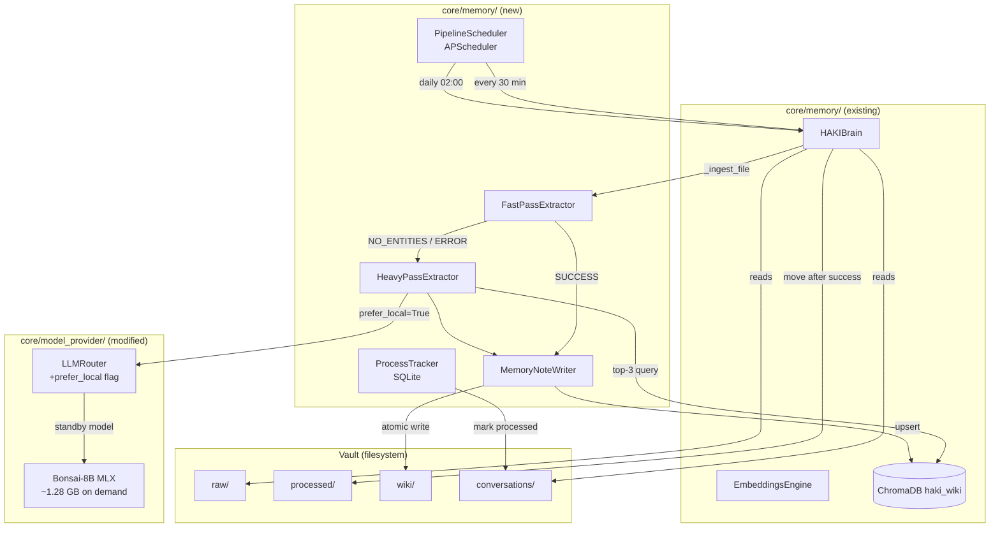
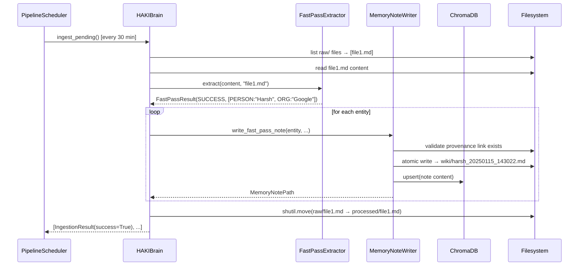
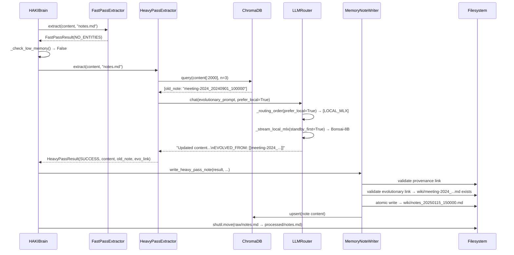
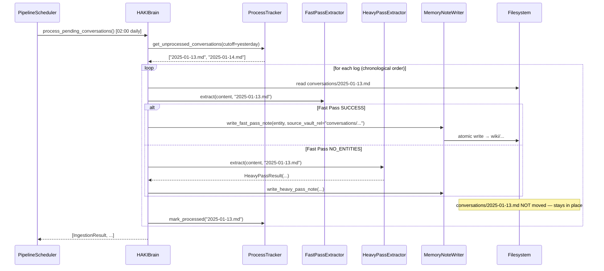

# Design Document: HAKI Brain Memory Processing Pipeline

## Overview

This design refactors `HAKIBrain._ingest_file()` from a monolithic LLM-always pattern into
a two-pass hybrid pipeline and adds supporting infrastructure for scheduled conversation
processing. The goal is to preserve the 8 GB unified memory budget on the M2 Mac by
invoking the local Bonsai-8B MLX model only when deterministic rules genuinely cannot
extract anything useful from a file.

**Core idea — Architect's Hybrid Pipeline:**
1. **Fast Pass** — spaCy `en_core_web_sm` + regex extracts entities from any Source_File in
   milliseconds, at zero GPU cost. One Memory_Note is written per extracted entity.
2. **Heavy Pass** — invoked only when the Fast Pass finds nothing. Retrieves the top-3
   semantically similar existing Memory_Notes from ChromaDB, then calls Bonsai-8B (via the
   existing `LLMRouter` with `prefer_local=True`) with an evolutionary prompt that merges
   old memory with new content and draws a directed Evolutionary_Link.

**What is NOT changed:**
- The vault's 3-folder structure (`raw/` → `processed/` + `wiki/`)
- `HAKIBrain.log_conversation()`, `search()`, and `remember_fact()` public APIs
- The `EmbeddingsEngine` and the `haki_wiki` ChromaDB collection
- The existing `Scheduler` class in `core/scheduler/` (task-reminder scheduler)

**What changes:**
- `HAKIBrain._ingest_file()` delegates to `FastPassExtractor` and `HeavyPassExtractor`
- Four new modules under `core/memory/`: `fast_pass.py`, `heavy_pass.py`,
  `memory_note_writer.py`, `process_tracker.py`
- A new `pipeline_scheduler.py` under `core/memory/` (APScheduler-backed background jobs)
- New parameter `prefer_local: bool = False` on `LLMRouter.chat()` and `stream_chat()`
- `Core/.env` corrected: `HAKI_OBSIDIAN_VAULT=/Users/harshkumarroy/Downloads/HKR/HAKI/HAKI_Brain`

**Note on terminology:** The requirements.md uses "Bonsai_LLM via Ollama" but the actual
codebase uses `mlx-community/Bonsai-8B-1bit` via `mlx_lm` (the standby local MLX model
in `LLMRouterConfig`). This design uses the MLX-based path throughout — there is no Ollama.


## Architecture

### High-Level Component Diagram



### Refactored `_ingest_file()` Call Tree

```
HAKIBrain._ingest_file(file_path)
  ├─ read content  (existing _read_file logic, unchanged)
  ├─ FastPassExtractor.extract(content, filename)
  │     └─ FastPassResult(status, entities, raw_markdown)
  ├─ if status == SUCCESS:
  │     ├─ for each entity: MemoryNoteWriter.write(entity, source_file, pass="fast")
  │     ├─ for each note: EmbeddingsEngine.upsert() into ChromaDB
  │     └─ shutil.move(file_path → processed/)
  └─ if status == NO_ENTITIES or ERROR:
        ├─ HeavyPassExtractor.extract(content, filename, chroma_collection, llm_router)
        │     └─ HeavyPassResult(status, memory_content, old_note_name, evolutionary_link)
        ├─ if status == SUCCESS:
        │     ├─ MemoryNoteWriter.write(result, source_file, pass="heavy")
        │     ├─ EmbeddingsEngine.upsert() into ChromaDB
        │     └─ shutil.move(file_path → processed/)
        └─ if status == FAILED:
              └─ leave file in raw/, log diagnostic, return IngestionResult(success=False)
```


## Components and Interfaces

### 1. Modified: `LLMRouter` (`core/model_provider/llm_router.py`)

**Change:** Add `prefer_local: bool = False` to both `stream_chat()` and `chat()`.

When `prefer_local=True`:
- `_routing_order()` returns `[LLMTier.LOCAL_MLX]` — no cloud fallback
- `_stream_local_mlx()` tries `mlx_standby_model` (Bonsai-8B) first, then
  `mlx_primary_model` (xLAM) as fallback, instead of the default order

**Rationale:** Bonsai-8B is the general-purpose synthesis model; xLAM is a tool-calling
specialist. Memory synthesis uses Bonsai-8B. However, if Bonsai-8B fails to load, falling
back to xLAM is still preferable to a Hard Pass failure.

```python
# core/model_provider/llm_router.py — diff summary

# stream_chat / chat: add prefer_local parameter
async def chat(
    self,
    user_message: str,
    system_prompt: str = "",
    *,
    prefer_large_context: bool = False,
    prefer_local: bool = False,          # NEW
    history: list[dict] | None = None,
) -> str: ...

# _routing_order: handle prefer_local
def _routing_order(self, message: str, prefer_large: bool, prefer_local: bool) -> list[LLMTier]:
    if prefer_local:
        return [LLMTier.LOCAL_MLX]      # skip cloud entirely
    # existing logic unchanged
    large = prefer_large or len(message) > self._cfg.large_context_threshold
    if large:
        return [LLMTier.GEMINI, LLMTier.GROQ, LLMTier.CEREBRAS, LLMTier.LOCAL_MLX]
    return [LLMTier.GROQ, LLMTier.CEREBRAS, LLMTier.GEMINI, LLMTier.LOCAL_MLX]

# _stream_local_mlx: when prefer_local, try standby (Bonsai-8B) first
async def _stream_local_mlx(
    self, message: str, system: str,
    history: list[dict] | None = None,
    prefer_standby: bool = False,       # NEW
) -> AsyncIterator[str]:
    order = (
        [self._cfg.mlx_standby_model, self._cfg.mlx_primary_model]
        if prefer_standby
        else [self._cfg.mlx_primary_model, self._cfg.mlx_standby_model]
    )
    for model_id in order:
        try:
            async for token in self._run_mlx_model(model_id, message, system, history):
                yield token
            return
        except Exception as exc:
            logger.warning("[LLMRouter] MLX model %s failed: %s", model_id, exc)
    raise RuntimeError("Both local MLX models failed")
```


### 2. New: `FastPassExtractor` (`core/memory/fast_pass.py`)

**Responsibility:** Deterministic, LLM-free extraction of named entities and structured
facts from any Source_File's text content.

```python
# core/memory/fast_pass.py

from __future__ import annotations
import re
from dataclasses import dataclass, field
from enum import Enum
from typing import Optional
import logging

logger = logging.getLogger(__name__)

# ---------------------------------------------------------------------------
# Data types
# ---------------------------------------------------------------------------

class FastPassStatus(str, Enum):
    SUCCESS    = "success"      # >=1 entity extracted
    NO_ENTITIES = "no_entities" # nothing found (trigger Heavy Pass)
    ERROR      = "error"        # exception during extraction (trigger Heavy Pass)


@dataclass
class Entity:
    text:  str       # surface form ("Harsh Kumar")
    label: str       # spaCy label ("PERSON") or regex category ("EMAIL", "URL", etc.)
    start: int       # char offset in content
    end:   int       # char offset in content


@dataclass
class FastPassResult:
    status:       FastPassStatus
    entities:     list[Entity]    = field(default_factory=list)
    raw_markdown: str             = ""   # pre-formatted note body per entity
    error_msg:    Optional[str]   = None


# ---------------------------------------------------------------------------
# Extractor
# ---------------------------------------------------------------------------

class FastPassExtractor:
    """
    CPU-only entity extractor. Loaded once at HAKIBrain.init() and reused.

    Extraction order:
      1. spaCy en_core_web_sm — PERSON, ORG, GPE, DATE, EVENT, PRODUCT
      2. Regex patterns       — EMAIL, URL, PHONE, HAKI_MARKER
      3. Hindi/Hinglish       — regex fallback for common markers
         when spaCy yields nothing AND content appears non-English
    """

    _ENTITY_LABELS = {"PERSON", "ORG", "GPE", "DATE", "EVENT", "PRODUCT"}

    _REGEX_PATTERNS: dict[str, re.Pattern] = {
        "EMAIL":       re.compile(r"\b[A-Za-z0-9._%+\-]+@[A-Za-z0-9.\-]+\.[A-Z|a-z]{2,}\b"),
        "URL":         re.compile(r"https?://[^\s]+"),
        "PHONE":       re.compile(r"\b(?:\+91[\-\s]?)?[6-9]\d{9}\b"),
        "HAKI_MARKER": re.compile(r"#haki\:[a-zA-Z0-9_\-]+", re.IGNORECASE),
    }

    # Common Hindi/Hinglish entity markers (name, place, company)
    _HINDI_FALLBACK_RE = re.compile(
        r"\b(?:naam|नाम|jagah|जगह|company|सिंह|कुमार|sharma|verma)\b",
        re.IGNORECASE,
    )

    def __init__(self) -> None:
        self._nlp = None   # lazy-loaded on first call

    def _load_spacy(self) -> None:
        if self._nlp is not None:
            return
        try:
            import spacy  # type: ignore[import]
            self._nlp = spacy.load("en_core_web_sm")
            logger.info("[FastPassExtractor] spaCy en_core_web_sm loaded")
        except (ImportError, OSError) as exc:
            logger.warning("[FastPassExtractor] spaCy unavailable: %s — regex-only mode", exc)
            self._nlp = False  # sentinel: spaCy unavailable, use regex only

    def extract(self, content: str, filename: str) -> FastPassResult:
        """
        Extract entities from *content*.

        Returns FastPassResult with status SUCCESS when >=1 entity found,
        NO_ENTITIES when the content yields nothing, or ERROR on exception.
        """
        try:
            self._load_spacy()
            entities: list[Entity] = []

            # 1. spaCy NER
            if self._nlp:
                doc = self._nlp(content[:100_000])  # cap to avoid OOM on huge files
                for ent in doc.ents:
                    if ent.label_ in self._ENTITY_LABELS:
                        entities.append(Entity(
                            text=ent.text, label=ent.label_,
                            start=ent.start_char, end=ent.end_char,
                        ))

            # 2. Regex patterns (run regardless of spaCy result)
            for label, pattern in self._REGEX_PATTERNS.items():
                for m in pattern.finditer(content):
                    entities.append(Entity(
                        text=m.group(), label=label,
                        start=m.start(), end=m.end(),
                    ))

            # 3. Hindi/Hinglish fallback: only if spaCy found nothing
            if not entities and self._HINDI_FALLBACK_RE.search(content):
                m = self._HINDI_FALLBACK_RE.search(content)
                entities.append(Entity(
                    text=m.group(), label="HINGLISH_ENTITY",
                    start=m.start(), end=m.end(),
                ))

            # Deduplicate by (text, label)
            seen: set[tuple[str, str]] = set()
            unique: list[Entity] = []
            for e in entities:
                key = (e.text.strip().lower(), e.label)
                if key not in seen:
                    seen.add(key)
                    unique.append(e)

            if not unique:
                return FastPassResult(status=FastPassStatus.NO_ENTITIES)

            return FastPassResult(
                status=FastPassStatus.SUCCESS,
                entities=unique,
                raw_markdown=_entities_to_markdown(unique, filename),
            )

        except Exception as exc:
            logger.error("[FastPassExtractor] Error extracting %s: %s", filename, exc)
            return FastPassResult(
                status=FastPassStatus.ERROR,
                error_msg=str(exc),
            )


def _entities_to_markdown(entities: list[Entity], filename: str) -> str:
    lines = [f"- **{e.label}**: {e.text}" for e in entities]
    return f"Extracted from `{filename}`:\n\n" + "\n".join(lines)
```


### 3. New: `HeavyPassExtractor` (`core/memory/heavy_pass.py`)

**Responsibility:** LLM-backed fallback extraction. Queries ChromaDB for similar notes,
then calls Bonsai-8B with an evolutionary prompt.

```python
# core/memory/heavy_pass.py

from __future__ import annotations
import asyncio
import logging
from dataclasses import dataclass
from enum import Enum
from typing import TYPE_CHECKING, Optional

if TYPE_CHECKING:
    from core.model_provider.llm_router import LLMRouter
    from core.model_provider.embeddings_engine import EmbeddingsEngine

logger = logging.getLogger(__name__)

_HEAVY_PASS_TIMEOUT_SECS = 30  # overridden by config HAKI_PIPELINE_LLM_TIMEOUT_SECS


class HeavyPassStatus(str, Enum):
    SUCCESS = "success"
    TIMEOUT = "timeout"       # LLM did not respond within timeout
    LLM_ERROR = "llm_error"   # LLM returned empty / unparseable content
    ERROR = "error"           # other exception


@dataclass
class HeavyPassResult:
    status:            HeavyPassStatus
    memory_content:    str         = ""
    old_memory_note_name: Optional[str] = None
    evolutionary_link: Optional[str]    = None


class HeavyPassExtractor:
    """
    Orchestrates semantic retrieval + Bonsai-8B synthesis for a single Source_File.

    Injected dependencies (all come from HAKIBrain):
      - chroma_collection : the haki_wiki ChromaDB collection
      - llm_router        : LLMRouter instance
      - timeout_secs      : float, default 30
    """

    def __init__(
        self,
        chroma_collection,
        llm_router: "LLMRouter",
        timeout_secs: float = _HEAVY_PASS_TIMEOUT_SECS,
    ) -> None:
        self._chroma = chroma_collection
        self._llm    = llm_router
        self._timeout = timeout_secs

    async def extract(
        self, content: str, filename: str
    ) -> HeavyPassResult:
        """
        1. Query ChromaDB for top-3 similar Memory_Notes.
        2. Build evolutionary prompt (with or without old memory).
        3. Call LLMRouter.chat(prefer_local=True) with timeout.
        4. Parse the result, extract EVOLVED_FROM if present.
        """
        # Step 1 — semantic retrieval (non-blocking via chroma_executor not
        # available here; caller (HAKIBrain) must run this in the chroma executor)
        old_note_name: Optional[str] = None
        old_note_content: Optional[str] = None

        try:
            count = self._chroma.count()
            if count > 0:
                results = self._chroma.query(
                    query_texts=[content[:2_000]],
                    n_results=min(3, count),
                    include=["documents", "metadatas"],
                )
                if results and results.get("ids") and results["ids"][0]:
                    # Use top-1 as the "old memory" for evolutionary linking
                    old_note_content = results["documents"][0][0]
                    meta = results["metadatas"][0][0]
                    old_note_name = meta.get("title", "unknown")
        except Exception as exc:
            logger.warning("[HeavyPassExtractor] ChromaDB query failed: %s", exc)

        # Step 2 — build prompt
        if old_note_name and old_note_content:
            prompt = _EVOLUTIONARY_PROMPT.format(
                old_note_name=old_note_name,
                old_note_content=old_note_content[:3_000],
                filename=filename,
                new_content=content[:4_000],
            )
        else:
            prompt = _FRESH_SYNTHESIS_PROMPT.format(
                filename=filename,
                new_content=content[:6_000],
            )

        # Step 3 — call Bonsai-8B with timeout
        try:
            memory_content = await asyncio.wait_for(
                self._llm.chat(
                    prompt,
                    system_prompt=_HEAVY_PASS_SYSTEM,
                    prefer_local=True,
                ),
                timeout=self._timeout,
            )
        except asyncio.TimeoutError:
            logger.error("[HeavyPassExtractor] Bonsai-8B timed out for %s", filename)
            return HeavyPassResult(status=HeavyPassStatus.TIMEOUT)
        except Exception as exc:
            logger.error("[HeavyPassExtractor] LLM error for %s: %s", filename, exc)
            return HeavyPassResult(status=HeavyPassStatus.LLM_ERROR)

        if not memory_content or not memory_content.strip():
            logger.error("[HeavyPassExtractor] Empty LLM response for %s", filename)
            return HeavyPassResult(status=HeavyPassStatus.LLM_ERROR)

        # Step 4 — parse EVOLVED_FROM line from LLM output
        evolutionary_link: Optional[str] = None
        lines = memory_content.splitlines()
        clean_lines = []
        for line in lines:
            if line.startswith("EVOLVED_FROM:"):
                ref = line.split(":", 1)[1].strip()
                evolutionary_link = ref  # e.g. "[[harsh-kumar-20250101_120000]]"
            else:
                clean_lines.append(line)
        clean_content = "\n".join(clean_lines).strip()

        return HeavyPassResult(
            status=HeavyPassStatus.SUCCESS,
            memory_content=clean_content,
            old_memory_note_name=old_note_name,
            evolutionary_link=evolutionary_link,
        )
```


### 4. New: `MemoryNoteWriter` (`core/memory/memory_note_writer.py`)

**Responsibility:** Writes Memory_Notes atomically to `wiki/` (following the Vault pattern),
validates all links before writing, and updates ChromaDB after successful write.

```python
# core/memory/memory_note_writer.py

from __future__ import annotations
import hashlib
import logging
import os
import re
import tempfile
from dataclasses import dataclass
from datetime import datetime, timezone
from pathlib import Path
from typing import Optional, TYPE_CHECKING

if TYPE_CHECKING:
    from core.memory.fast_pass import Entity, FastPassResult
    from core.memory.heavy_pass import HeavyPassResult

logger = logging.getLogger(__name__)


@dataclass
class MemoryNotePath:
    path:       Path
    title:      str
    wiki_link:  str    # "[[concept_slug_YYYYMMDD_HHMMSS]]"


def _slugify(text: str) -> str:
    """Convert text to a safe filename slug."""
    text = text.lower().strip()
    text = re.sub(r"[^\w\s\-]", "", text)
    text = re.sub(r"[\s_]+", "-", text)
    return text[:60].strip("-")


def validate_wiki_link(target: str, vault_root: Path) -> bool:
    """
    Return True if *target* (without [[ ]]) resolves to an existing .md file
    anywhere in the vault.

    Search order:
      1. vault_root / wiki / target.md
      2. vault_root / target.md
    """
    for candidate in [
        vault_root / "wiki" / f"{target}.md",
        vault_root / f"{target}.md",
    ]:
        if candidate.exists():
            return True
    return False


class MemoryNoteWriter:
    """
    Writes one Memory_Note per call to wiki/ using atomic temp-then-rename writes.
    Validates all link targets before writing. Updates ChromaDB after write.

    Parameters
    ----------
    wiki_dir    : Path to vault/wiki/
    vault_root  : Path to vault root (for link resolution)
    chroma_collection : haki_wiki ChromaDB collection
    """

    def __init__(
        self,
        wiki_dir: Path,
        vault_root: Path,
        chroma_collection,
    ) -> None:
        self._wiki = wiki_dir
        self._vault = vault_root
        self._chroma = chroma_collection

    # ------------------------------------------------------------------
    # Fast Pass write
    # ------------------------------------------------------------------

    def write_fast_pass_note(
        self,
        entity: "Entity",
        source_file: str,
        source_vault_rel: str,
        run_date: str,
    ) -> Optional[MemoryNotePath]:
        """Write one Memory_Note for a single entity extracted by Fast Pass."""
        slug = _slugify(entity.text)
        ts = datetime.now(timezone.utc).strftime("%Y%m%d_%H%M%S")
        title = f"{slug}_{ts}"
        provenance = source_vault_rel.replace("\\", "/")

        # Validate provenance link
        provenance_target = Path(provenance)
        if not (self._vault / provenance_target).exists():
            logger.warning(
                "[MemoryNoteWriter] Provenance target does not exist: %s — skipping note",
                provenance,
            )
            return None

        content = _FAST_PASS_TEMPLATE.format(
            concept_slug=slug,
            iso8601=datetime.now(timezone.utc).isoformat(),
            vault_rel=provenance,
            source_filename=source_file,
            entity_label=entity.label,
            entity_type_lower=entity.label.lower(),
            run_date=run_date,
        )
        return self._write_atomic(title, content)

    # ------------------------------------------------------------------
    # Heavy Pass write
    # ------------------------------------------------------------------

    def write_heavy_pass_note(
        self,
        result: "HeavyPassResult",
        source_file: str,
        source_vault_rel: str,
        run_date: str,
    ) -> Optional[MemoryNotePath]:
        """Write one Memory_Note produced by the Heavy Pass."""
        slug = _slugify(source_file.replace(".md", "").replace(".txt", ""))
        ts = datetime.now(timezone.utc).strftime("%Y%m%d_%H%M%S")
        title = f"{slug}_{ts}"
        provenance = source_vault_rel.replace("\\", "/")

        # Validate provenance link
        if not (self._vault / Path(provenance)).exists():
            logger.warning(
                "[MemoryNoteWriter] Provenance target does not exist: %s — skipping note",
                provenance,
            )
            return None

        # Validate evolutionary link if present
        evo_link_text = ""
        if result.old_memory_note_name:
            evo_target = result.old_memory_note_name
            if validate_wiki_link(evo_target, self._vault):
                evo_link_text = (
                    f"\n*Evolved from: [[{evo_target}]] ({run_date})*"
                )
            else:
                logger.warning(
                    "[MemoryNoteWriter] Evolutionary link target does not exist: %s — skipped",
                    evo_target,
                )

        content = _HEAVY_PASS_TEMPLATE.format(
            concept_slug=slug,
            iso8601=datetime.now(timezone.utc).isoformat(),
            vault_rel=provenance,
            evolved_from=result.old_memory_note_name or "",
            llm_content=result.memory_content,
            source_filename=source_file,
            evo_link=evo_link_text,
        )
        return self._write_atomic(title, content)

    # ------------------------------------------------------------------
    # Atomic write (following Vault.store() pattern)
    # ------------------------------------------------------------------

    def _write_atomic(self, title: str, content: str) -> Optional[MemoryNotePath]:
        target = self._wiki / f"{title}.md"
        tmp_path: Optional[Path] = None
        try:
            fd, tmp_str = tempfile.mkstemp(
                dir=self._wiki, suffix=".tmp", prefix=title
            )
            tmp_path = Path(tmp_str)
            with os.fdopen(fd, "w", encoding="utf-8") as fh:
                fh.write(content)
                fh.flush()
                os.fsync(fh.fileno())
            tmp_path.rename(target)
            tmp_path = None

            wiki_link = f"[[{title}]]"
            note_path = MemoryNotePath(path=target, title=title, wiki_link=wiki_link)

            # Update ChromaDB
            self._embed_note(title, content, target)

            logger.info("[MemoryNoteWriter] Wrote %s", target.name)
            return note_path

        except Exception as exc:
            logger.error("[MemoryNoteWriter] Failed to write %s: %s", title, exc)
            if tmp_path is not None and tmp_path.exists():
                try:
                    tmp_path.unlink()
                except OSError:
                    pass
            return None

    def _embed_note(self, title: str, content: str, note_path: Path) -> None:
        if self._chroma is None:
            return
        try:
            doc_id = hashlib.sha256(str(note_path).encode()).hexdigest()[:16]
            self._chroma.upsert(
                ids=[doc_id],
                documents=[content[:4_000]],
                metadatas=[{
                    "title": title,
                    "wiki_path": str(note_path),
                    "created": datetime.now(timezone.utc).isoformat(),
                }],
            )
        except Exception as exc:
            logger.warning("[MemoryNoteWriter] ChromaDB embed failed for %s: %s", title, exc)
```


### 5. New: `ProcessTracker` (`core/memory/process_tracker.py`)

**Responsibility:** SQLite-backed tracker for conversation log processing state.
Tracks which daily conversation logs have been fully processed so they are never
re-processed on the next `Conversation_Scheduler` run.

```python
# core/memory/process_tracker.py

from __future__ import annotations
import sqlite3
import logging
from datetime import date
from pathlib import Path

logger = logging.getLogger(__name__)

_DDL = """
CREATE TABLE IF NOT EXISTS processed_logs (
    filename    TEXT PRIMARY KEY,  -- e.g. "2025-01-15.md"
    processed_at TEXT NOT NULL     -- ISO8601 UTC timestamp
);
"""


class ProcessTracker:
    """
    Thread-safe (serialised via a single connection with WAL mode) SQLite tracker.

    DB path: ~/.haki/pipeline_tracker.db  (created on first use)
    """

    def __init__(self, db_path: Path | None = None) -> None:
        if db_path is None:
            db_path = Path.home() / ".haki" / "pipeline_tracker.db"
        db_path.parent.mkdir(parents=True, exist_ok=True)
        self._db_path = db_path
        self._conn = sqlite3.connect(str(db_path), check_same_thread=False)
        self._conn.execute("PRAGMA journal_mode=WAL")
        self._conn.execute(_DDL)
        self._conn.commit()
        logger.info("[ProcessTracker] Ready (db=%s)", db_path)

    def mark_processed(self, filename: str) -> None:
        """Record that *filename* has been fully processed."""
        from datetime import datetime, timezone
        self._conn.execute(
            "INSERT OR REPLACE INTO processed_logs (filename, processed_at) VALUES (?, ?)",
            (filename, datetime.now(timezone.utc).isoformat()),
        )
        self._conn.commit()
        logger.debug("[ProcessTracker] Marked processed: %s", filename)

    def is_processed(self, filename: str) -> bool:
        """Return True if *filename* has been marked as processed."""
        cur = self._conn.execute(
            "SELECT 1 FROM processed_logs WHERE filename = ?", (filename,)
        )
        return cur.fetchone() is not None

    def get_unprocessed_conversations(
        self, cutoff_date: date, conversations_dir: Path
    ) -> list[str]:
        """
        Return a list of YYYY-MM-DD.md filenames in *conversations_dir* whose
        date is <= *cutoff_date* and that have not yet been marked as processed,
        sorted oldest-first (chronological order, Req 6.6).
        """
        candidates = sorted(conversations_dir.glob("????-??-??.md"))
        result: list[str] = []
        for log_file in candidates:
            try:
                log_date = date.fromisoformat(log_file.stem)
            except ValueError:
                continue
            if log_date <= cutoff_date and not self.is_processed(log_file.name):
                result.append(log_file.name)
        return result  # already sorted because glob results were sorted

    def close(self) -> None:
        self._conn.close()
```


### 6. New: `PipelineScheduler` (`core/memory/pipeline_scheduler.py`)

**Responsibility:** APScheduler-backed background job runner for the two independent
processing schedules. Entirely separate from `core/scheduler/Scheduler`, which manages
user task reminders.

```python
# core/memory/pipeline_scheduler.py

from __future__ import annotations
import logging
import asyncio
from typing import TYPE_CHECKING, Optional

if TYPE_CHECKING:
    from core.memory.haki_brain import HAKIBrain

logger = logging.getLogger(__name__)


class PipelineScheduler:
    """
    Manages two independent APScheduler background jobs:
      - raw_job        : calls HAKIBrain.ingest_pending() every Raw_Interval minutes
      - conversation_job: calls HAKIBrain.process_pending_conversations() at Conversation_Run_Time

    Uses AsyncIOScheduler so jobs run in the existing asyncio event loop without
    spawning additional threads.

    Parameters
    ----------
    haki_brain            : HAKIBrain instance
    raw_interval_minutes  : int, default 30
    conv_run_time         : str "HH:MM" 24h, default "02:00"
    """

    def __init__(
        self,
        haki_brain: "HAKIBrain",
        raw_interval_minutes: int = 30,
        conv_run_time: str = "02:00",
    ) -> None:
        self._brain = haki_brain
        self._raw_interval = raw_interval_minutes
        self._conv_time = conv_run_time
        self._scheduler = None
        self._raw_job_running = False
        self._conv_job_running = False

    def start(self) -> None:
        """Start the APScheduler with both jobs. Call once at service startup."""
        try:
            from apscheduler.schedulers.asyncio import AsyncIOScheduler  # type: ignore
            from apscheduler.triggers.interval import IntervalTrigger  # type: ignore
            from apscheduler.triggers.cron import CronTrigger           # type: ignore
        except ImportError:
            logger.error("[PipelineScheduler] pip install apscheduler")
            return

        hour, minute = self._parse_time(self._conv_time)
        self._scheduler = AsyncIOScheduler()

        self._scheduler.add_job(
            self._raw_job,
            trigger=IntervalTrigger(minutes=self._raw_interval),
            id="haki_raw_pipeline",
            name="HAKIBrain raw/ processing",
            max_instances=1,         # skip if already running (Req 9.6)
            coalesce=True,
        )

        self._scheduler.add_job(
            self._conv_job,
            trigger=CronTrigger(hour=hour, minute=minute),
            id="haki_conv_pipeline",
            name="HAKIBrain conversations/ processing",
            max_instances=1,         # skip if already running (Req 9.6)
            coalesce=True,
        )

        self._scheduler.start()
        logger.info(
            "[PipelineScheduler] Started — raw every %d min, conv at %s",
            self._raw_interval, self._conv_time,
        )

    def stop(self) -> None:
        if self._scheduler is not None:
            self._scheduler.shutdown(wait=False)

    async def _raw_job(self) -> None:
        if self._raw_job_running:
            logger.info("[PipelineScheduler] Raw job already running — skipping")
            return
        self._raw_job_running = True
        try:
            results = await self._brain.ingest_pending()
            logger.info("[PipelineScheduler] Raw run complete: %d file(s)", len(results))
        except Exception as exc:
            logger.error("[PipelineScheduler] Raw job failed: %s", exc)
        finally:
            self._raw_job_running = False

    async def _conv_job(self) -> None:
        if self._conv_job_running:
            logger.info("[PipelineScheduler] Conversation job already running — skipping")
            return
        self._conv_job_running = True
        try:
            await self._brain.process_pending_conversations()
        except Exception as exc:
            logger.error("[PipelineScheduler] Conversation job failed: %s", exc)
        finally:
            self._conv_job_running = False

    @staticmethod
    def _parse_time(time_str: str) -> tuple[int, int]:
        """Parse 'HH:MM' into (hour, minute). Falls back to (2, 0) on error."""
        try:
            h, m = time_str.split(":")
            return int(h), int(m)
        except Exception:
            logger.error(
                "[PipelineScheduler] Invalid HAKI_PIPELINE_CONV_RUN_TIME '%s' — using 02:00",
                time_str,
            )
            return 2, 0
```

**Integration in `haki_core_service.py`:** Replace `haki_brain.start_watching()` with
`PipelineScheduler(haki_brain, ...).start()`. The `_watch_loop()` method in `HAKIBrain`
is retained as a fallback but `auto_watch_interval` defaults to 0 when `PipelineScheduler`
is used.


### 7. Modified: `HAKIBrain` (`core/memory/haki_brain.py`)

**Changes required:**

1. Import and instantiate `FastPassExtractor`, `HeavyPassExtractor`, `MemoryNoteWriter`,
   and `ProcessTracker` in `__init__()`.
2. Replace the body of `_ingest_file()` with the hybrid routing logic (see below).
3. Add `process_pending_conversations()` as a new public method.
4. Add low-memory guard using `psutil` before Heavy Pass invocations.

**`__init__()` additions:**

```python
# In HAKIBrain.__init__():
from core.memory.fast_pass import FastPassExtractor
from core.memory.heavy_pass import HeavyPassExtractor
from core.memory.memory_note_writer import MemoryNoteWriter
from core.memory.process_tracker import ProcessTracker

import os
self._fast_pass = FastPassExtractor()
self._process_tracker = ProcessTracker()
self._llm_timeout = float(os.environ.get("HAKI_PIPELINE_LLM_TIMEOUT_SECS", "30"))
self._low_memory_mb = float(os.environ.get("HAKI_PIPELINE_LOW_MEMORY_THRESHOLD_MB", "500"))
# MemoryNoteWriter and HeavyPassExtractor are created lazily in _ingest_file()
# so they receive the chroma_collection which is set during init()
```

**`_check_low_memory()` utility:**

```python
def _check_low_memory(self) -> bool:
    """Return True if available memory is below the low-memory threshold."""
    try:
        import psutil
        available_mb = psutil.virtual_memory().available / (1024 * 1024)
        return available_mb < self._low_memory_mb
    except ImportError:
        return False  # psutil not installed, no memory guard
```


## Data Models

### Core Pipeline Data Types

```python
# FastPassResult (core/memory/fast_pass.py)
@dataclass
class FastPassResult:
    status:       FastPassStatus           # SUCCESS | NO_ENTITIES | ERROR
    entities:     list[Entity]             # extracted entities (empty on non-SUCCESS)
    raw_markdown: str                      # pre-formatted note body text
    error_msg:    Optional[str] = None    # populated on ERROR

# Entity (core/memory/fast_pass.py)
@dataclass
class Entity:
    text:  str   # surface form, e.g. "Harsh Kumar"
    label: str   # spaCy label or regex category, e.g. "PERSON", "EMAIL"
    start: int   # character offset in source content
    end:   int   # character offset in source content

# HeavyPassResult (core/memory/heavy_pass.py)
@dataclass
class HeavyPassResult:
    status:               HeavyPassStatus  # SUCCESS | TIMEOUT | LLM_ERROR | ERROR
    memory_content:       str              # LLM-synthesized note body (EVOLVED_FROM stripped)
    old_memory_note_name: Optional[str]    # title of retrieved Memory_Note, or None
    evolutionary_link:    Optional[str]    # "[[old-note-name]]" or None

# MemoryNotePath (core/memory/memory_note_writer.py)
@dataclass
class MemoryNotePath:
    path:      Path   # absolute path to written .md file
    title:     str    # stem of filename, e.g. "harsh-kumar_20250115_143022"
    wiki_link: str    # Obsidian link, e.g. "[[harsh-kumar_20250115_143022]]"

# PipelineRunSummary (inline in HAKIBrain, logged at run end)
@dataclass
class PipelineRunSummary:
    total_files:     int
    notes_created:   int
    fast_pass_hits:  int
    heavy_pass_hits: int
    errors:          int
    run_start:       str   # ISO8601
    run_end:         str   # ISO8601
```

### Memory_Note Naming Scheme

Pattern: `{concept_slug}_{YYYYMMDD_HHMMSS}.md`

- **concept_slug**: for Fast Pass, the slugified entity text (e.g. `harsh-kumar`);
  for Heavy Pass, the slugified source filename stem (e.g. `meeting-notes-jan-2025`)
- **timestamp suffix**: UTC timestamp at write time; prevents collisions across runs
- **Examples:**
  - `harsh-kumar_20250115_143022.md` (Fast Pass, PERSON entity)
  - `google-org_20250115_143025.md` (Fast Pass, ORG entity)
  - `meeting-notes-jan-2025_20250115_143100.md` (Heavy Pass)

### `FastPassStatus` and `HeavyPassStatus` Enums

| Enum | Value | Meaning |
|------|-------|---------|
| `FastPassStatus.SUCCESS` | "success" | ≥1 entity extracted |
| `FastPassStatus.NO_ENTITIES` | "no_entities" | Nothing found → Heavy Pass |
| `FastPassStatus.ERROR` | "error" | Exception during extraction → Heavy Pass |
| `HeavyPassStatus.SUCCESS` | "success" | LLM produced valid content |
| `HeavyPassStatus.TIMEOUT` | "timeout" | LLM exceeded timeout |
| `HeavyPassStatus.LLM_ERROR` | "llm_error" | Empty or unparseable LLM response |
| `HeavyPassStatus.ERROR` | "error" | Other exception |


## Refactored `_ingest_file()` Algorithm

This pseudocode replaces the existing `_ingest_file()` body in `haki_brain.py`.

```python
async def _ingest_file(self, file_path: Path) -> IngestionResult:
    filename = file_path.name
    self._in_progress.add(filename)
    run_date = datetime.now(timezone.utc).strftime("%Y-%m-%d")

    writer = MemoryNoteWriter(
        wiki_dir=self._wiki,
        vault_root=self._vault,
        chroma_collection=self._chroma_collection,
    )

    try:
        # Step 1: Read content (existing logic, unchanged)
        content, content_type = await self._read_file(file_path)
        if not content.strip():
            return IngestionResult(source_file=filename, success=False,
                                   error="Empty or unreadable file")
        content = _truncate_for_llm(content)

        # Vault-relative source path for provenance links
        # After successful processing the file will be at processed/{filename}
        source_vault_rel = f"processed/{filename}"

        # Step 2: Fast Pass
        fast_result = await asyncio.get_event_loop().run_in_executor(
            None, self._fast_pass.extract, content, filename
        )

        notes_written: list[MemoryNotePath] = []

        if fast_result.status == FastPassStatus.SUCCESS:
            # Step 3a: Write one Memory_Note per entity
            for entity in fast_result.entities:
                note = writer.write_fast_pass_note(
                    entity=entity,
                    source_file=filename,
                    source_vault_rel=source_vault_rel,
                    run_date=run_date,
                )
                if note:
                    notes_written.append(note)

            if not notes_written:
                # All notes failed link validation — fall through to Heavy Pass
                logger.warning("[HAKIBrain] Fast Pass: all notes failed validation for %s", filename)
            else:
                # Step 4a: Move source file raw/ → processed/
                dest = self._get_processed_dest(file_path)
                import shutil
                shutil.move(str(file_path), str(dest))
                logger.info("[HAKIBrain] Fast Pass complete for %s (%d notes)", filename, len(notes_written))
                return IngestionResult(source_file=filename, success=True,
                                       wiki_page_path=str(notes_written[0].path))

        # Step 3b: Heavy Pass (Fast Pass failed or yielded no valid notes)
        if fast_result.status == FastPassStatus.ERROR:
            logger.warning("[HAKIBrain] Fast Pass error for %s: %s — falling through to Heavy Pass",
                           filename, fast_result.error_msg)

        # Low-memory guard before loading Bonsai-8B
        if self._check_low_memory():
            logger.warning("[HAKIBrain] Low memory — deferring Heavy Pass for %s", filename)
            return IngestionResult(source_file=filename, success=False,
                                   error="Low memory: Heavy Pass deferred")

        heavy_extractor = HeavyPassExtractor(
            chroma_collection=self._chroma_collection,
            llm_router=self._llm,
            timeout_secs=self._llm_timeout,
        )
        # ChromaDB query must run in the chroma executor
        heavy_result = await asyncio.get_event_loop().run_in_executor(
            self._chroma_executor,
            lambda: asyncio.run(heavy_extractor.extract(content, filename))
        )
        # Note: heavy_extractor.extract() is async; we run it directly in the event loop:
        heavy_result = await heavy_extractor.extract(content, filename)

        if heavy_result.status != HeavyPassStatus.SUCCESS:
            logger.error("[HAKIBrain] Heavy Pass failed for %s: %s", filename, heavy_result.status)
            return IngestionResult(source_file=filename, success=False,
                                   error=f"Heavy Pass {heavy_result.status}")

        # Step 4b: Write Heavy Pass note
        note = writer.write_heavy_pass_note(
            result=heavy_result,
            source_file=filename,
            source_vault_rel=source_vault_rel,
            run_date=run_date,
        )
        if not note:
            logger.error("[HAKIBrain] Heavy Pass: note write failed for %s", filename)
            return IngestionResult(source_file=filename, success=False,
                                   error="Heavy Pass note write failed")

        # Step 5: Move source file only after successful write
        dest = self._get_processed_dest(file_path)
        import shutil
        shutil.move(str(file_path), str(dest))
        logger.info("[HAKIBrain] Heavy Pass complete for %s → %s", filename, note.title)
        return IngestionResult(source_file=filename, success=True,
                               wiki_page_path=str(note.path))

    except Exception as exc:
        logger.error("[HAKIBrain] _ingest_file failed for %s: %s", filename, exc)
        return IngestionResult(source_file=filename, success=False, error=str(exc))
    finally:
        self._in_progress.discard(filename)


def _get_processed_dest(self, file_path: Path) -> Path:
    """Return the destination path in processed/, handling collisions."""
    dest = self._processed / file_path.name
    if dest.exists():
        from datetime import datetime, timezone
        ts = datetime.now(timezone.utc).strftime("%Y%m%d_%H%M%S")
        dest = self._processed / f"{file_path.stem}_{ts}{file_path.suffix}"
    return dest
```


## Refactored Conversation Processing

`log_conversation()` is unchanged. A new public method handles scheduled processing.

```python
# New method on HAKIBrain

async def process_pending_conversations(self) -> list[IngestionResult]:
    """
    Process all unprocessed conversation logs dated on or before yesterday.
    Logs are processed in chronological order (oldest first).
    Conversation files are never moved — they remain in conversations/.

    Called by PipelineScheduler at the Conversation_Run_Time.
    """
    from datetime import date, timedelta
    cutoff = date.today() - timedelta(days=1)  # never process today's log

    unprocessed = self._process_tracker.get_unprocessed_conversations(
        cutoff_date=cutoff,
        conversations_dir=self._conversations,
    )

    if not unprocessed:
        logger.info("[HAKIBrain] No unprocessed conversation logs")
        return []

    logger.info("[HAKIBrain] Processing %d conversation log(s)", len(unprocessed))
    results: list[IngestionResult] = []
    summary = {"notes": 0, "fast": 0, "heavy": 0, "errors": 0}

    for log_filename in unprocessed:  # chronological order guaranteed by ProcessTracker
        log_path = self._conversations / log_filename
        result = await self._process_conversation_log(log_path)
        results.append(result)

        if result.success:
            self._process_tracker.mark_processed(log_filename)
            summary["notes"] += 1
        else:
            summary["errors"] += 1

    logger.info(
        "[HAKIBrain] Conversation run complete: processed=%d errors=%d",
        summary["notes"], summary["errors"],
    )
    return results


async def _process_conversation_log(self, log_path: Path) -> IngestionResult:
    """
    Apply Fast Pass → Heavy Pass to a conversation log.
    The log file is NEVER moved.
    Vault-relative path for provenance: conversations/{filename}
    """
    filename = log_path.name
    run_date = datetime.now(timezone.utc).strftime("%Y-%m-%d")

    writer = MemoryNoteWriter(
        wiki_dir=self._wiki,
        vault_root=self._vault,
        chroma_collection=self._chroma_collection,
    )

    try:
        content = log_path.read_text(encoding="utf-8", errors="replace")
        if not content.strip():
            return IngestionResult(source_file=filename, success=False,
                                   error="Empty conversation log")

        # Provenance points to conversations/ (file is NOT moved)
        source_vault_rel = f"conversations/{filename}"

        fast_result = await asyncio.get_event_loop().run_in_executor(
            None, self._fast_pass.extract, content, filename
        )

        if fast_result.status == FastPassStatus.SUCCESS:
            notes_written = []
            for entity in fast_result.entities:
                note = writer.write_fast_pass_note(
                    entity=entity,
                    source_file=filename,
                    source_vault_rel=source_vault_rel,
                    run_date=run_date,
                )
                if note:
                    notes_written.append(note)
            if notes_written:
                return IngestionResult(source_file=filename, success=True,
                                       wiki_page_path=str(notes_written[0].path))

        # Fall through to Heavy Pass
        if self._check_low_memory():
            return IngestionResult(source_file=filename, success=False,
                                   error="Low memory: Heavy Pass deferred")

        heavy_extractor = HeavyPassExtractor(
            chroma_collection=self._chroma_collection,
            llm_router=self._llm,
            timeout_secs=self._llm_timeout,
        )
        heavy_result = await heavy_extractor.extract(content, filename)

        if heavy_result.status != HeavyPassStatus.SUCCESS:
            return IngestionResult(source_file=filename, success=False,
                                   error=f"Heavy Pass {heavy_result.status}")

        note = writer.write_heavy_pass_note(
            result=heavy_result,
            source_file=filename,
            source_vault_rel=source_vault_rel,
            run_date=run_date,
        )
        if not note:
            return IngestionResult(source_file=filename, success=False,
                                   error="Note write failed")

        return IngestionResult(source_file=filename, success=True,
                               wiki_page_path=str(note.path))

    except Exception as exc:
        logger.error("[HAKIBrain] Conversation processing failed for %s: %s", filename, exc)
        return IngestionResult(source_file=filename, success=False, error=str(exc))
```


## Memory_Note File Format

### Fast Pass Memory_Note

```markdown
---
title: "{concept_slug}_{YYYYMMDD_HHMMSS}"
created: "{ISO8601 UTC}"
pass: "fast"
sources:
  - "[[{vault_relative_source_path}]]"
tags:
  - {entity_type_lower}
---

## {concept_slug}

- **Entity type:** {entity_label}
- **Extracted from:** [[{source_filename}]]
- **Date:** {run_date}

---
*Source: [[{vault_relative_source_path}]]*
```

**Example** (entity: "Harsh Kumar", label: "PERSON", source: "meeting-jan-15.md"):

```markdown
---
title: "harsh-kumar_20250115_143022"
created: "2025-01-15T14:30:22+00:00"
pass: "fast"
sources:
  - "[[processed/meeting-jan-15.md]]"
tags:
  - person
---

## harsh-kumar

- **Entity type:** PERSON
- **Extracted from:** [[meeting-jan-15.md]]
- **Date:** 2025-01-15

---
*Source: [[processed/meeting-jan-15.md]]*
```

### Heavy Pass Memory_Note

```markdown
---
title: "{concept_slug}_{YYYYMMDD_HHMMSS}"
created: "{ISO8601 UTC}"
pass: "heavy"
sources:
  - "[[{vault_relative_source_path}]]"
evolved_from: "{old_memory_note_name}"
tags:
  - memory
---

{LLM-synthesized content — EVOLVED_FROM line stripped}

---
*Source: [[{vault_relative_source_path}]]*
*Evolved from: [[{old_memory_note_name}]] ({run_date})*
```

The `evolved_from` frontmatter key is omitted (set to empty string) when the Heavy Pass
runs without any existing similar note (ChromaDB returned no results).


## Evolutionary Prompt Design

Two prompt templates are used by `HeavyPassExtractor`:

### Template 1: Evolutionary Prompt (old memory exists)

```
_HEAVY_PASS_SYSTEM = """
You are HAKI's memory evolution engine. Your ONLY job is to merge old memory with new
information and produce a clean, updated Obsidian wiki note body.

Rules:
1. Read the OLD memory note and the NEW source content below.
2. Write an UPDATED note that combines all facts — old and new.
3. On its own line at the very end, write: EVOLVED_FROM: [[{old_note_name}]]
4. Do NOT hallucinate. Do NOT add facts absent from both inputs.
5. Output ONLY the Markdown body. No frontmatter. No preamble.
"""

_EVOLUTIONARY_PROMPT = """
OLD MEMORY NOTE ({old_note_name}):
{old_note_content}

NEW SOURCE CONTENT ({filename}):
{new_content}

Write the updated memory note body, then end with:
EVOLVED_FROM: [[{old_note_name}]]
"""
```

### Template 2: Fresh Synthesis Prompt (no existing memory)

```
_FRESH_SYNTHESIS_PROMPT = """
SOURCE CONTENT ({filename}):
{new_content}

Extract key facts, entities, and relationships. Write a clean, structured Obsidian
wiki note body. Use ## headings and bullet points. Be concise. No frontmatter.
"""
```

**Design rationale:** Using `EVOLVED_FROM:` as a machine-readable marker at the end of
the LLM's output is simpler and more reliable than asking the LLM to produce YAML
frontmatter. The `HeavyPassExtractor.extract()` method strips this line and stores the
link separately, which `MemoryNoteWriter` validates before embedding in the note.


## Sequence Diagrams

### a. Fast Pass Success Path



### b. Heavy Pass Path



### c. Conversation Processing Path




## Hardware Budget Analysis

All measurements are for the M2 Mac (8 GB unified memory) at peak Heavy Pass usage.

| Component | Memory | Load Pattern | Notes |
|-----------|--------|--------------|-------|
| spaCy `en_core_web_sm` | ~15 MB | Resident after first call to `_load_spacy()` | Loaded once at startup, never unloaded |
| ChromaDB + MiniLM embeddings | ~85 MB | Resident (shared with existing `EmbeddingsEngine`) | Already in use; no additional cost |
| Bonsai-8B MLX 1-bit | ~1.28 GB | On-demand per Heavy Pass invocation | Loaded by `mlx_lm.load()` in thread executor; local variable → GC'd after each call |
| **Pipeline overhead total** | **~1.38 GB** | Peak during Heavy Pass | |
| Remaining for HAKI processes | ~6.62 GB | TTS, STT, Orchestrator, MemoryBrain | Comfortable headroom |

**Key design decisions that protect the budget:**

1. **Sequential Heavy Pass** — only one Source_File runs through Bonsai-8B at a time
   (Req 7.2, 7.3). `ingest_pending()` iterates files sequentially with `await`.
2. **On-demand loading** — `mlx_lm.load(model_id)` is called inside a thread executor
   as a local variable. When `_generate()` returns, the model reference goes out of scope
   and is garbage collected (Req 7.4). No persistent model cache.
3. **Low-memory guard** — if `psutil.virtual_memory().available` drops below
   `HAKI_PIPELINE_LOW_MEMORY_THRESHOLD_MB` (default 500 MB), the Heavy Pass is suspended
   and the file is left in `raw/` for the next scheduled run (Req 7.6).
4. **Fast Pass has zero LLM cost** — spaCy `en_core_web_sm` (15 MB) runs on CPU only,
   fully within the ANE tier, with no GPU or Metal usage.


## Configuration

All keys are read from `Core/.env` via `python-dotenv` (already loaded at the top of
`haki_core_service.py` with `override=True`).

| Key | Default | Range / Format | Where used |
|-----|---------|----------------|------------|
| `HAKI_OBSIDIAN_VAULT` | *(required)* | Absolute path starting with `/` | `haki_core_service.py` → `HAKIBrain` constructor |
| `HAKI_PIPELINE_RAW_INTERVAL_MINUTES` | `30` | 1–1440 (integer) | `PipelineScheduler` raw job interval |
| `HAKI_PIPELINE_CONV_RUN_TIME` | `02:00` | `HH:MM` 24h local time | `PipelineScheduler` conversation job cron |
| `HAKI_PIPELINE_LOW_MEMORY_THRESHOLD_MB` | `500` | Positive float | `HAKIBrain._check_low_memory()` |
| `HAKI_PIPELINE_LLM_TIMEOUT_SECS` | `30` | Positive float | `HeavyPassExtractor` timeout |

### Required `.env` Fix

The current `.env` (or its default fallback in `haki_core_service.py`) points to
`~/Obsidian/HAKI_Brain`. This must be corrected:

```dotenv
# Core/.env  — add or update this line
HAKI_OBSIDIAN_VAULT=/Users/harshkumarroy/Downloads/HKR/HAKI/HAKI_Brain
```

### Startup Validation (Req 8.3, 8.5)

`HAKIBrain.init()` must validate the vault path before creating folder structure:

```python
def init(self) -> None:
    vault_str = str(self._vault)
    if not vault_str.startswith("/"):
        raise ValueError(f"HAKI_OBSIDIAN_VAULT must be an absolute path, got: {vault_str}")
    if not self._vault.exists():
        raise FileNotFoundError(f"Vault directory does not exist: {self._vault}")
    if not os.access(str(self._vault), os.R_OK | os.W_OK):
        raise PermissionError(f"Vault directory not readable/writable: {self._vault}")
    # ... existing folder creation logic
```

### `haki_core_service.py` Changes

Replace:
```python
haki_brain.start_watching()
```

With:
```python
import os
from core.memory.pipeline_scheduler import PipelineScheduler

_raw_interval = _safe_int(os.environ.get("HAKI_PIPELINE_RAW_INTERVAL_MINUTES", "30"), 30, 1, 1440)
_conv_time    = os.environ.get("HAKI_PIPELINE_CONV_RUN_TIME", "02:00")

pipeline_scheduler = PipelineScheduler(
    haki_brain=haki_brain,
    raw_interval_minutes=_raw_interval,
    conv_run_time=_conv_time,
)
pipeline_scheduler.start()
```

Where `_safe_int(value, default, min_, max_)` returns `default` if `value` is
out-of-range or non-integer (Req 9.7), logging a warning if so.


## Scheduler Integration

The existing `core/scheduler/Scheduler` class handles user task reminders — it is
**not modified**. The pipeline needs independent background jobs that integrate with the
`asyncio` event loop already running in `haki_core_service.py`.

### Why APScheduler, not the existing `Scheduler`

The existing `Scheduler` in `core/scheduler/scheduler.py` is a synchronous, pure-Python
class for computing and issuing reminder offsets relative to task due dates. It has no
concept of periodic background execution. `APScheduler` with `AsyncIOScheduler` is the
standard Python library for this pattern and can fire coroutines directly in the existing
event loop.

### Job Configuration Summary

| Job | ID | Trigger | Calls | max_instances |
|-----|----|---------|-------|---------------|
| Raw processing | `haki_raw_pipeline` | `IntervalTrigger(minutes=30)` | `HAKIBrain.ingest_pending()` | 1 (skip on overlap) |
| Conversation processing | `haki_conv_pipeline` | `CronTrigger(hour=2, minute=0)` | `HAKIBrain.process_pending_conversations()` | 1 (skip on overlap) |

Both jobs use `coalesce=True` — if multiple triggers fire while the job is running, only
one queued execution is retained (Req 9.4, 9.6).

### Live Turn Deferral (Req 9.5, 9.8)

The Orchestrator holds a thread-safe `asyncio.Event` named `_live_turn_active`. Before
any Vault-modifying operation in `_ingest_file()` or `_process_conversation_log()`,
`HAKIBrain` checks this event:

```python
# HAKIBrain — check before vault write
async def _wait_for_live_turn(self, timeout: float = 600.0) -> bool:
    """Wait for any active live turn to complete. Returns True if OK to proceed."""
    if not hasattr(self, '_live_turn_event'):
        return True  # no live turn tracking wired up
    try:
        await asyncio.wait_for(self._live_turn_event.wait(), timeout=timeout)
        return True
    except asyncio.TimeoutError:
        logger.warning("[HAKIBrain] Live turn deferral timed out after %.0fs — aborting pipeline write", timeout)
        return False
```

The `Orchestrator` sets/clears `_live_turn_event` at the start and end of each
conversational turn.


## Correctness Properties

*A property is a characteristic or behavior that should hold true across all valid
executions of a system — essentially, a formal statement about what the system should do.
Properties serve as the bridge between human-readable specifications and machine-verifiable
correctness guarantees.*

This feature is well-suited for property-based testing because the core logic — entity
extraction, note creation, link validation, file movement — involves pure or near-pure
functions over structured inputs where input variation reveals edge cases (e.g., Unicode
content, entities with special characters, collision-prone filenames).

Property tests use [Hypothesis](https://hypothesis.readthedocs.io/) with `@given` and
are configured to run at least 100 iterations per property.

---

### Property 1: Fast Pass Idempotency

*For any* string content, running `FastPassExtractor.extract()` twice on the same content
returns the same set of (text, label) entity pairs as a single run. The extraction is
deterministic and stateless — calling it again on unchanged input yields identical output.

**Validates: Requirements 1.2, 1.3**

---

### Property 2: No LLM Call During Fast Pass Success

*For any* content string for which `FastPassExtractor.extract()` returns
`FastPassStatus.SUCCESS` (i.e., at least one entity found), `LLMRouter.chat()` is never
called during the processing of that file. The LLM call counter on a mock `LLMRouter`
remains zero.

**Validates: Requirements 1.1, 1.3, 1.6, 7.1**

---

### Property 3: Provenance Link Completeness

*For any* Memory_Note written by `MemoryNoteWriter` (via either the Fast Pass or the Heavy
Pass), the note's Markdown body contains exactly one line matching `*Source: [[...]]* ` and
the target of that link resolves to an existing file within the vault at write time.

**Validates: Requirements 3.1, 3.2, 3.3, 11.1, 11.2, 11.4**

---

### Property 4: Entity-to-Note Count (Fast Pass)

*For any* content string that yields a `FastPassResult` with `N` unique (text, label)
entities and all provenance links validate, `MemoryNoteWriter.write_fast_pass_note()` is
called exactly `N` times and exactly `N` new `.md` files appear in `wiki/`.

**Validates: Requirements 1.4**

---

### Property 5: File Movement Atomicity

*For any* set of files in `raw/` at the start of an `ingest_pending()` call, after the
call completes (success or failure), every file that was in `raw/` at call-start is
located in exactly one of `raw/` or `processed/` — no file is deleted, renamed to an
unknown location, or lost. (A file whose processing failed remains in `raw/`; a
successfully processed file is in `processed/`.)

**Validates: Requirements 4.1, 4.4, 4.5, 4.6, 10.2, 10.3, 10.5**

---

### Property 6: Evolutionary Link Validity

*For any* `HeavyPassExtractor.extract()` invocation where the ChromaDB query returns at
least one existing Memory_Note, and when `HeavyPassStatus.SUCCESS` is returned, the
`HeavyPassResult.evolutionary_link` field either:
- Is `None` (the LLM chose not to emit `EVOLVED_FROM:`), or
- Contains `[[old_note_name]]` where `old_note_name` is the title of the retrieved note
  AND `validate_wiki_link(old_note_name, vault_root)` returns `True` before the note
  is written.

In no case does `MemoryNoteWriter` write an Evolutionary_Link whose target does not exist.

**Validates: Requirements 5.1, 5.3, 5.4, 11.2, 11.5**

---

### Property 7: Link Resolution

*For any* `[[target]]` string written anywhere in any Memory_Note by `MemoryNoteWriter`,
`validate_wiki_link(target, vault_root)` returns `True` at the time of the write call.
No dangling wiki links are ever written to disk.

**Validates: Requirements 11.1, 11.2, 11.4, 11.5**

---

### Property 8: Conversation Log Immutability

*For any* set of conversation log files in `conversations/` before a
`process_pending_conversations()` call, after the call completes, every conversation log
file in `conversations/` has byte-for-byte identical content to its pre-call state. No
conversation log is moved, renamed, or modified.

**Validates: Requirements 6.3, 6.4**

---

### Property 9: Conversation Log Processing Idempotency

*For any* conversation log file that has been marked as processed by `ProcessTracker`,
a second call to `process_pending_conversations()` does not create any new Memory_Notes
derived from that log and does not alter any existing Memory_Notes in `wiki/`. The set of
files in `wiki/` is unchanged from before the second call.

**Validates: Requirements 6.5**


## Error Handling

### Per-File Error Isolation (Req 10.1)

`ingest_pending()` wraps each `_ingest_file()` call in a try/except and continues to the
next file on any exception. A failed file is never removed from `raw/`.

```python
for file_path in pending:
    try:
        result = await self._ingest_file(file_path)
    except Exception as exc:
        logger.error("[HAKIBrain] Unexpected error for %s: %s", file_path.name, exc)
        result = IngestionResult(source_file=file_path.name, success=False, error=str(exc))
    results.append(result)
```

### Atomic Write Protection (Req 10.2)

`MemoryNoteWriter._write_atomic()` follows the exact `Vault.store()` pattern:
1. Write to a temp file in the same directory as the target
2. `fsync()` the temp file
3. Atomic `rename()` to the final path
4. If any step fails: `unlink()` the temp file, return `None`

No partial note is ever left in `wiki/`.

### Diagnostic Log at Run End (Req 10.4)

After `ingest_pending()` and `process_pending_conversations()` complete, a summary is
logged at INFO level:

```
[HAKIBrain] Pipeline run complete: files=5 notes=12 fast_pass=3 heavy_pass=2 errors=0
```

### Error Decision Table

| Failure Mode | File stays in raw/? | Diagnostic logged? | Retry on next run? |
|---|---|---|---|
| File unreadable / empty | Yes | Yes | Yes |
| Fast Pass exception | No (→ Heavy Pass) | Yes | n/a |
| Heavy Pass LLM timeout | Yes | Yes | Yes |
| Heavy Pass empty response | Yes | Yes | Yes |
| Note write failed (link invalid) | Yes | Yes | Yes |
| Filesystem move failed | Yes | Yes | Yes |
| Low memory during Heavy Pass | Yes | Yes | Yes |
| Both passes fail | Yes | Yes | Yes |

### Conversation Processing Error Handling

If both passes fail for a conversation log, `mark_processed()` is NOT called, and
the log will be retried on the next `Conversation_Scheduler` run (Req 6.8).


## Testing Strategy

### Unit Tests (example-based)

Focus on specific behaviors, edge cases, and integration points.

**`tests/test_fast_pass.py`**
- `test_extract_person_entity` — content with a known PERSON entity yields SUCCESS
- `test_extract_email` — regex pattern matches email addresses
- `test_extract_empty_content` — empty string returns NO_ENTITIES
- `test_extract_non_english_hinglish` — "naam Harsh" triggers Hindi fallback
- `test_extract_deduplication` — duplicate entities are deduplicated
- `test_extract_spacy_unavailable` — falls back to regex-only when spaCy not installed

**`tests/test_heavy_pass.py`**
- `test_extract_with_old_memory` — builds evolutionary prompt when ChromaDB has results
- `test_extract_without_old_memory` — builds fresh synthesis prompt when ChromaDB empty
- `test_extract_llm_timeout` — returns TIMEOUT status, file left in raw/
- `test_extract_empty_llm_response` — returns LLM_ERROR status
- `test_evolved_from_parsing` — `EVOLVED_FROM: [[note]]` line is stripped and stored

**`tests/test_memory_note_writer.py`**
- `test_write_fast_pass_note_creates_file` — file appears in wiki/ after write
- `test_write_atomic_no_partial_on_failure` — simulated write failure leaves no .tmp
- `test_validate_wiki_link_existing` — returns True for existing file
- `test_validate_wiki_link_missing` — returns False for non-existent file
- `test_evolutionary_link_skipped_if_target_missing` — evo link not written if invalid
- `test_provenance_link_skipped_if_source_missing` — note not created if source absent

**`tests/test_process_tracker.py`**
- `test_mark_and_is_processed` — mark then query returns True
- `test_unprocessed_returns_false` — query before mark returns False
- `test_get_unprocessed_ordered` — returns list sorted oldest-first
- `test_cutoff_date_filtering` — today's log excluded from unprocessed list

**`tests/test_haki_brain_pipeline.py`**
- `test_ingest_pending_fast_pass_moves_file` — source file moved to processed/ on success
- `test_ingest_pending_heavy_pass_fallback` — Heavy Pass invoked when Fast Pass empty
- `test_ingest_pending_both_fail_leaves_file` — file stays in raw/ on both-pass failure
- `test_process_conversations_does_not_move_logs` — conversation files stay in place
- `test_low_memory_defers_heavy_pass` — psutil mock triggers deferral

### Property Tests (Hypothesis)

Use [Hypothesis](https://hypothesis.readthedocs.io/) with minimum 100 iterations.
Each test is tagged with the property it validates.

```python
# Example structure — tests/test_pipeline_properties.py
from hypothesis import given, settings
from hypothesis import strategies as st

@given(st.text(min_size=1, max_size=10_000))
@settings(max_examples=100)
def test_fast_pass_idempotency(content):
    """Feature: haki-brain-memory-processing-pipeline, Property 1: Fast Pass Idempotency"""
    extractor = FastPassExtractor()
    result1 = extractor.extract(content, "test.md")
    result2 = extractor.extract(content, "test.md")
    assert result1.status == result2.status
    pairs1 = {(e.text, e.label) for e in result1.entities}
    pairs2 = {(e.text, e.label) for e in result2.entities}
    assert pairs1 == pairs2

@given(st.text(min_size=1, max_size=5_000))
@settings(max_examples=100)
def test_no_llm_call_during_fast_pass_success(content):
    """Feature: haki-brain-memory-processing-pipeline, Property 2: No LLM Call During Fast Pass"""
    extractor = FastPassExtractor()
    result = extractor.extract(content, "test.md")
    if result.status == FastPassStatus.SUCCESS:
        mock_llm = Mock()
        # If we were to call _ingest_file, the mock should never be called
        assert mock_llm.chat.call_count == 0

# ... (each property gets one @given test referencing its property number)
```

**Tag format:** `Feature: haki-brain-memory-processing-pipeline, Property {N}: {property_title}`

**Properties mapped to tests:**

| Property | Test function | min_examples |
|---|---|---|
| P1: Fast Pass Idempotency | `test_fast_pass_idempotency` | 100 |
| P2: No LLM Call During Fast Pass | `test_no_llm_call_fast_pass_success` | 100 |
| P3: Provenance Link Completeness | `test_provenance_link_in_all_notes` | 100 |
| P4: Entity-to-Note Count | `test_entity_count_equals_note_count` | 100 |
| P5: File Movement Atomicity | `test_file_movement_atomicity` | 100 |
| P6: Evolutionary Link Validity | `test_evolutionary_link_validity` | 100 |
| P7: Link Resolution | `test_all_links_resolve_at_write_time` | 100 |
| P8: Conversation Log Immutability | `test_conversation_log_immutability` | 50 |
| P9: Conversation Log Idempotency | `test_conversation_log_idempotency` | 50 |

### Integration Tests (smoke)

- `test_vault_path_env_var_required` — missing `HAKI_OBSIDIAN_VAULT` aborts init
- `test_vault_path_must_be_absolute` — relative path aborts init
- `test_vault_path_must_exist` — non-existent path aborts init
- `test_pipeline_scheduler_job_config` — APScheduler jobs configured with correct triggers

### New Dependencies

Add to `requirements.txt` / `pyproject.toml`:
```
spacy>=3.7                  # Fast Pass NLP
# After install: python -m spacy download en_core_web_sm
apscheduler>=3.10           # PipelineScheduler background jobs
psutil>=5.9                 # Low-memory guard
hypothesis>=6.100           # Property-based testing (dev/test only)
```

