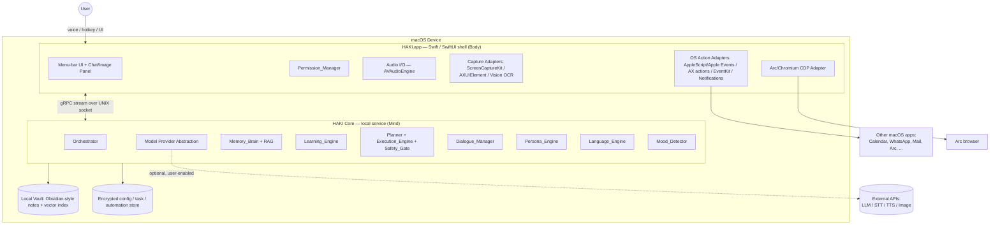
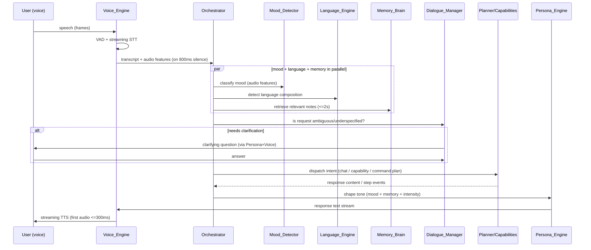
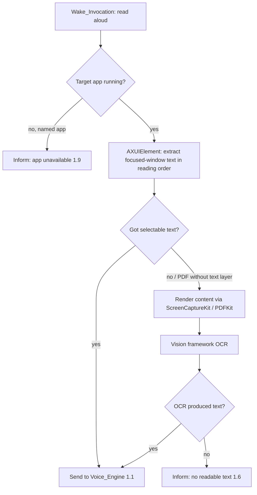
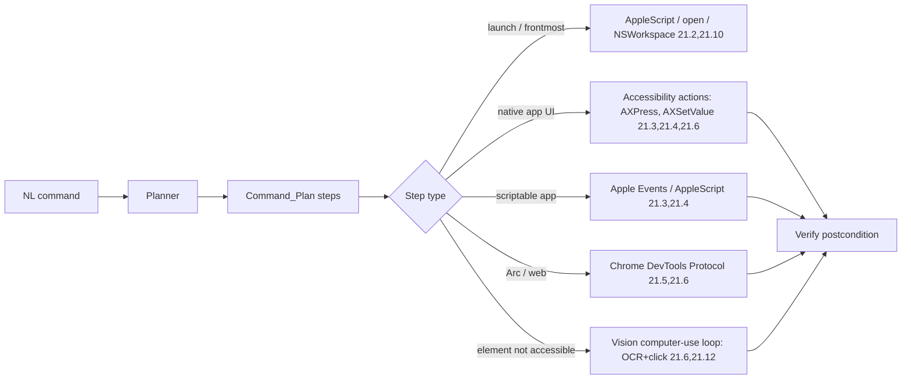
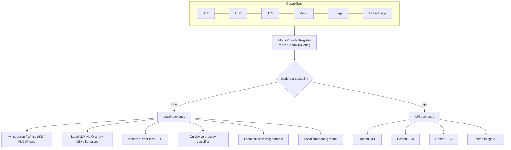
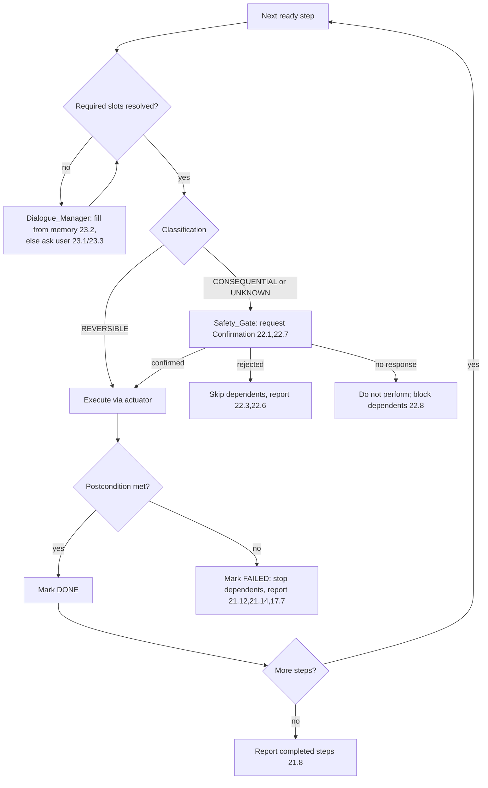
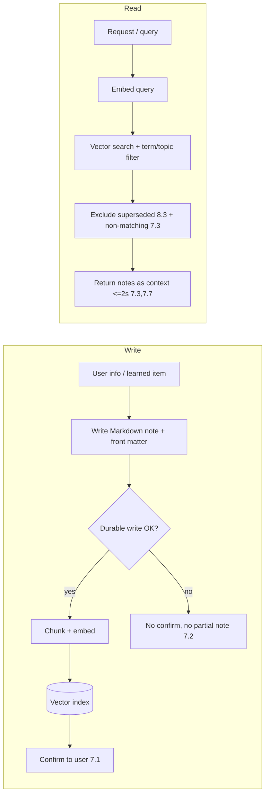
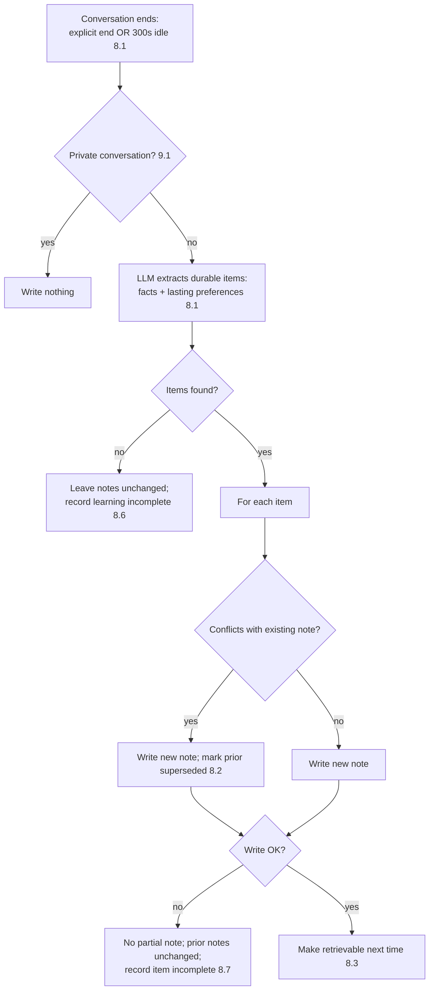

# Design Document

## Overview

HAKI (Heuristic Augmented Knowledge Interface) is a macOS personal AI assistant that reads the screen aloud, holds zero-latency Hinglish voice conversations, senses mood, remembers everything in a local knowledge vault, automates calendar/communication work, generates images by voice, runs reusable named automations, and performs general agentic control of the Mac — all under an explicit permission and safety-confirmation model.

This design translates the 23 approved requirements into a concrete technical architecture. The dominant forces shaping it are:

- **Deep OS integration** — screen capture, accessibility tree access, application control, calendar, notifications, and global input require native macOS frameworks (Accessibility/AXUIElement, ScreenCaptureKit, Vision, EventKit, AppleScript/Apple Events, UserNotifications). (Reqs 1, 2, 11, 12, 14, 16, 21)
- **Hard real-time latency budgets** — the voice loop must produce first audio within 300 ms, full response within 1.5 s, and barge-in stop within 200 ms. This forces a streaming, cancellable pipeline rather than request/response calls. (Req 3)
- **Privacy and data locality** — memory and learning are local-first, and every model-backed capability must be switchable between an on-device model and an external API, with explicit disclosure when data leaves the device. (Reqs 7, 8, 9, 20)
- **Agentic safety** — broad Mac control is powerful and dangerous, so a planner/executor with a consequential-action confirmation gate and interactive clarifying dialogue is central, not an afterthought. (Reqs 21, 22, 23)

### Recommended Architecture at a Glance

A **two-process hybrid**:

1. **HAKI.app — native Swift / SwiftUI shell** (the "Body"): owns all macOS integration that legally and technically must be native — TCC permissions, ScreenCaptureKit, Accessibility, Vision OCR, EventKit, AppleScript/Apple Events bridge, global hotkey/Wake_Invocation, audio I/O (AVAudioEngine), the menu-bar UI, notifications, and the secure on-device store.
2. **HAKI Core — local orchestration service** (the "Mind"): a long-lived process that runs the orchestrator, the Model Provider abstraction, the RAG/memory engine, the agentic planner, and the dialogue manager. Recommended implementation language is **Python** (best ecosystem for STT/LLM/TTS/embeddings, MLX, RAG tooling) running as a child process of the app, communicating over a local IPC channel (gRPC/JSON-RPC over a UNIX domain socket) with a streaming/bidirectional transport for tokens and audio frames.

This split is justified in the Architecture section. The two processes ship together as a single signed `.app` bundle so the user installs and grants permissions once. No HAKI component listens on a network port reachable off-device by default.

### Requirements-to-Subsystem Map

| Requirement | Primary subsystem(s) |
|---|---|
| 1 Screen Reading | Screen_Reader, Voice_Engine |
| 2 Screen Permissions | Permission_Manager (HAKI) |
| 3 Zero-Latency Voice | Voice_Engine (VAD, STT, TTS), Orchestrator |
| 4 Mood Detection | Mood_Detector, Persona_Engine |
| 5 Hinglish | Language_Engine, Voice_Engine |
| 6 Personality | Persona_Engine |
| 7 Persistent Memory | Memory_Brain |
| 8 Autonomous Learning | Learning_Engine, Memory_Brain |
| 9 Privacy Boundaries | Memory_Brain, Learning_Engine, Privacy_Manager |
| 10 Comms Reading | Comms_Reader |
| 11 Calendar | Scheduler, Dialogue_Manager |
| 12 Severity Reminders | Scheduler, Clock, Voice_Engine |
| 13 Task Tracking | Task_Tracker, Scheduler |
| 14 Temporal Awareness | Clock |
| 15 Image Studio | Image_Studio, Model Provider |
| 16 Smart Text Input | Text_Assistant |
| 17 Named Automations | Automation_Library, Execution_Engine |
| 18 Question-Paper Analysis | Automation_Library, Memory_Brain |
| 19 Document Humanization | Automation_Library, Language_Engine |
| 20 Deployment Model | Model_Provider abstraction, Settings |
| 21 Mac Control | Mac_Controller, Planner, Execution_Engine |
| 22 Safety Confirmation | Safety_Gate (Execution_Engine) |
| 23 Clarifying Dialogue | Dialogue_Manager |

## Architecture

### System Context



### Why a Swift shell + local Python core (Requirement 20.1, 21, 3)

Three options were considered:

1. **Fully native (Swift only).** Best OS integration and lowest audio latency, but the on-device AI ecosystem (Whisper variants, local LLM runtimes, embedding models, RAG tooling, Hinglish handling) is far richer in Python, and binding every model into Swift would slow iteration on a solo project.
2. **Fully cross-platform (Electron/Node only).** Fast UI iteration, but Electron cannot cleanly reach the Accessibility API, Apple Events, EventKit, or ScreenCaptureKit, and adds audio latency — disqualifying for Reqs 1, 3, 21.
3. **Hybrid: native shell + local service (recommended).** The Swift shell owns everything that *must* be native (permissions, capture, OS actions, audio, UI); the local service owns AI orchestration where Python's ecosystem wins. The cost is an IPC boundary, mitigated by a streaming transport.

The hybrid is recommended because the requirements simultaneously demand deep, native-only OS capabilities **and** a rich, swappable model stack. The IPC seam also enforces a clean separation between "the Mind" (reasoning) and "the Body" (actuators), which is exactly the boundary the agentic and safety requirements need.

> Single-developer note: if the IPC boundary proves too heavy early on, the same module boundaries can be collapsed into one process by embedding Python via `PythonKit` or by running models through Swift bindings (e.g., WhisperKit) — the component interfaces below are defined so this is an implementation swap, not a redesign.

### Process & Threading Model

- **Audio realtime thread (Swift):** AVAudioEngine tap captures mic frames; a lightweight VAD runs here so barge-in and end-of-speech detection never wait on IPC (Req 3.2, 3.3).
- **Streaming IPC (Swift ⇄ Core):** bidirectional gRPC stream carries audio frames up and TTS audio / control events down. Partial STT, LLM tokens, and TTS chunks all flow as streamed messages so the 300 ms first-audio budget is achievable (Req 3.1).
- **Orchestrator event loop (Core, async):** routes a single "turn" through the subsystems, cancellable at any await point (needed for barge-in and clarifying-dialogue pauses).
- **Background workers (Core):** Comms polling, Learning_Engine extraction, reminder scheduling run off the turn loop so they never block conversation.

### The Orchestrator (Requirements 3, 4, 5, 6, 7, 23)

The Orchestrator is the central router for a conversational turn. It does not contain capability logic; it sequences subsystems and owns turn lifecycle/cancellation.



### Intent Routing

After transcription and language detection, the Orchestrator asks the LLM (via Model Provider) to classify the turn into one of a small set of intents, each owned by a subsystem:

- `read_aloud` → Screen_Reader (Req 1)
- `chat` / `recall` / `remember` → Persona_Engine + Memory_Brain (Reqs 6, 7)
- `mac_command` (ad-hoc control) → Planner → Execution_Engine (Req 21)
- `run_automation` (named) → Automation_Library (Reqs 17–19)
- `image` → Image_Studio (Req 15)
- `schedule` / `task` → Scheduler / Task_Tracker (Reqs 11–13)
- `meta` (time, settings, privacy, permissions) → Clock / Settings / Privacy_Manager (Reqs 2, 9, 14, 20)

Routing is itself a model call, so it is subject to the same clarifying-dialogue gate: if intent or required slots are ambiguous, control passes to the Dialogue_Manager before any side effect (Req 23.1).

## Components and Interfaces

Interfaces are described in language-neutral form. Methods that stream are marked `stream`. Each component lists the requirements it satisfies.

### Permission_Manager (Requirement 2, 21.15)

Owns macOS TCC permission state for Screen Recording, Accessibility, and Automation (Apple Events), plus HAKI's own user-facing "screen content access" toggle.

```
PermissionManager:
  status(permission) -> {granted, denied, undetermined}
  request(permission) -> opens system prompt / deep-links System Settings  (2.1)
  missingFor(capability) -> [permission]                                   (2.2)
  watch() stream-> PermissionChangeEvent     # detects revocation/grant    (2.7)
  screenAccessEnabled: Bool  (user toggle, always reachable)               (2.4, 2.5)
```

Behavior:
- Before a capability runs, the Orchestrator calls `missingFor`. If non-empty, the capability is declined within 2 s with a message naming the permission, the blocked capability, and the System Settings path (2.2, 2.6, 21.15).
- A polling/notification watcher detects revocation while running and disables dependent capabilities within 5 s (2.7).
- When the user toggle is off, Screen_Reader declines and explains, regardless of TCC state (2.5).

### Screen_Reader (Requirement 1)

```
ScreenReader:
  captureFocused(appName?: String) -> CapturedContent | NoContent | AppUnavailable
  readAloud(content) stream-> playback controlled by Voice_Engine
  control(command: pause|resume|stop)        # ordered command queue       (1.5, 1.8)
```

Capture strategy (layered fallback), mapped to Reqs 1.2–1.4, 1.6:



- **Primary path:** Accessibility API (`AXUIElement`) reads the focused window's text in reading order — fast, accurate, and works for native apps and most documents (1.1, 1.2).
- **PDF path:** PDFKit text extraction; if it yields nothing or errors, fall back to OCR (1.3).
- **Image/no-text path:** ScreenCaptureKit captures the region, Vision framework performs OCR (1.4).
- **Named app:** resolve by name; if not running/found, decline and inform (1.7, 1.9).
- **Playback control:** commands flow into an ordered queue; when multiple arrive within 200 ms, priority is stop > pause > resume (1.5, 1.8).
- Capture of ≤10,000 characters must reach the Voice_Engine within 3 s (1.1) — AX extraction is the fast path that makes this budget realistic; OCR is the slower fallback used only when needed.

### Voice_Engine (Requirements 3, 5.4, 12.6)

The most latency-critical component. Implemented as a streaming pipeline split across the Swift shell (audio I/O + VAD) and Core (STT/TTS models via Model Provider).

```
VoiceEngine:
  listen() stream-> {partialTranscript, finalTranscript, audioFeatures, endOfSpeech}
  speak(textStream) stream-> audio playback, cancellable                  (3.1)
  bargeInStop()                                                           (3.3)
  onSttFailure -> prompt repeat (no transcribed request processed)        (3.6)
  onTtsFailure -> render text on screen + notify                          (3.7)
```

See the dedicated **Voice Pipeline** section for the latency design.

### Mood_Detector (Requirement 4)

```
MoodDetector:
  classify(audioFeatures, durationMs) -> MoodResult
  threshold: Float  # default 0.6, configurable 0.0–1.0                    (4.2)

MoodResult = { primaryMood: angry|sad|happy|neutral, confidence: 0.0–1.0 }
           | { unclassifiable: true }                                     (4.7, 4.8)
```

- Requires ≥1 s of speech; shorter clips return `unclassifiable` (4.1, 4.7).
- Uses an acoustic classifier over prosodic features (pitch, volume/energy, and derived features) — a small on-device model (e.g., an audio-feature classifier) under the Model Provider so it can also be an API (4.1).
- Emits exactly one result per request to the Persona_Engine (4.8). The Persona_Engine consumes mood, not the Mood_Detector (4.3–4.6 are Persona behaviors).

### Language_Engine (Requirements 5, 19.4)

```
LanguageEngine:
  analyze(text) -> { composition: hindi|english|hinglish|unknown, tokens: [{word, origin}] }  (5.1, 5.2, 5.3)
  generateConstraints(composition) -> response-language constraint for LLM prompt
  humanizeProse(segment) -> humanizedSegment                              (19.4)
  onUninterpretable -> not-understood + prompt rephrase                   (5.5)
```

- Accepts Hindi/English/Hinglish without asking the user to pick a language (5.1).
- Determines language composition by tokenizing and tagging each token's origin (script + lexicon heuristics + model). The composition constrains generation: Hinglish in → Hinglish out (≥1 Hindi-origin and ≥1 English-origin word, never fully Hindi) (5.2); monolingual in → same language out (5.3).
- The per-token origin map is passed to the Voice_Engine so TTS pronounces each word in its origin language (5.4) — see Voice Pipeline.

### Persona_Engine (Requirement 6, 4.3–4.6)

```
PersonaEngine:
  intensity: Level  # >= 3 ordered levels, min..max                       (6.3)
  shape(responseDraft, mood?, memoryContext?) -> styledResponseStream     (6.1, 6.2, 6.5)
```

- Applies a consistent HAKI identity at every intensity (6.1). Identity + intensity are encoded as a system-prompt template injected into the LLM call.
- Incorporates mood and memory context into tone when available (6.2); at minimum intensity prefers conciseness over personality when they conflict (6.4); proceeds with whatever inputs are available without waiting for missing mood/memory (6.5).
- For mood-driven tone: angry→calming, sad→encouraging, otherwise/neutral/low-confidence→neutral (4.3–4.6).

### Memory_Brain (Requirements 7, 9.2–9.6, 9.8)

```
MemoryBrain:
  remember(content, tags?, source) -> StoreResult  # confirms only after durable write  (7.1, 7.2)
  retrieve(query, k) -> [Note]   # term/topic match, <=2s                  (7.3, 7.7)
  forget(noteId) -> confirm                                               (7.6, 9.4)
  forgetAll() -> confirm                                                  (9.5, 9.6)
  export() -> singleFile (user-accessible)                                (9.3, 9.8)
  init() -> ensure vault + index exist even when empty                    (7.4)
```

See the **Memory, RAG & Learning** section.

### Learning_Engine (Requirements 8, 9.1)

```
LearningEngine:
  onConversationEnd(transcript, isPrivate) -> LearningReport              (8.1, 8.6, 8.7, 9.1)
  recentlyLearned(days=7, range 1..90) -> [LearnedItem]                   (8.4)
  markIncorrect(itemId) -> remove + confirm                               (8.5)
```

See the **Memory, RAG & Learning** section.

### Comms_Reader (Requirements 10)

```
CommsReader:
  connect(account) / disconnect(account)                                  (10.5, 10.8, 10.9)
  poll() stream-> [Message]   # WhatsApp + Email
  extractActionables(message) -> [ActionableItem]                         (10.1, 10.2, 10.3)
  flagIncomplete(item) -> present to user                                 (10.4)
  # retry up to 3x at 30s, then notify which account failed               (10.6, 10.7)
```

Integration approach:
- **WhatsApp:** no official desktop read API. Read via accessibility/automation of the WhatsApp desktop app (AX tree of the chat list/messages) or WhatsApp Web driven through the CDP adapter. The user explicitly grants/revokes this connection (10.5). Revocation stops reads within 5 s (10.8).
- **Email:** IMAP for generic accounts; Gmail API (OAuth) for Gmail. Polling/IDLE detects new mail within the 60 s budget (10.2).
- **Actionable extraction:** an LLM classifies each message and extracts date/time/location/description (10.3). Missing date or time → flag for clarification and surface to user (10.4). Identified items implying events are handed to the Scheduler (Req 11).

### Scheduler (Requirements 11, 12, 14.2)

```
Scheduler:
  proposeEvent(actionable) -> Proposal      # <=5s after identification   (11.1)
  confirmEvent(proposal, edits?) -> CalendarEvent | ValidationError       (11.2–11.6)
  createTask(details) -> Task (assigns Severity)                          (12.1, 12.11)
  scheduleReminders(task) -> [Reminder]                                   (12.2–12.5, 12.7, 12.8, 12.10)
  issueReminder(reminder) -> via Voice_Engine + notification              (12.6, 12.9)
```

- Writes events to the system calendar via **EventKit** (11.3).
- Requires explicit Confirmation before any event creation (11.2); supports reject (11.4) and confirm-with-edits, validating date/time (11.5, 11.6); on creation failure, no partial event, retain details for retry (11.7).
- Severity classification drives reminder timing (12.1–12.5); custom valid timing overrides defaults, invalid falls back to default (12.7, 12.8); elapsed reminder windows fire immediately (12.10); per-reminder failure still issues the rest and notifies (12.9); indeterminate severity → default + notify (12.11).
- All reminder times computed from the Clock (12 via 14.2).

### Task_Tracker (Requirement 13)

```
TaskTracker:
  list(incompleteOnly=true) -> [Task] ordered by dueDate   # <=2s         (13.1, 13.2)
  onDuePassed(task) -> ask completed? within 60s                          (13.3)
  markComplete(task) -> stop reminders                                    (13.4, 13.5)
  prerequisites(task) -> [Prereq] with status                            (13.6)
  add(task) -> persist (no partial; retain on failure)                    (13.7)
```

### Clock (Requirement 14)

```
Clock:
  now() -> { date, time, timezone } | Unavailable                         (14.1, 14.5)
  watchTimezone() stream-> TimezoneChange  # propagate within 5s          (14.4)
```

Single source of truth for time; all time-dependent subsystems read from it (14.1, 14.2, 14.3); unavailability is surfaced to subsystems and the user (14.5).

### Image_Studio (Requirement 15)

```
ImageStudio:
  generate(prompt) -> Image (display + save)                              (15.1, 15.4)
  edit(instruction, target=lastImage|referencedImage) -> Image           (15.2, 15.3)
  # save failure: keep in-session, inform                                 (15.5)
  # generation failure: inform + reason                                   (15.6)
```

- Image model runs through the Model Provider (local diffusion model or external image API) (15.1, 20).
- Maintains a session history of displayed images so "edit the last image" / "edit that earlier image" resolve correctly (15.2, 15.3).
- Saves to a designated user-accessible folder and confirms; on save failure keeps the image in-session (15.4, 15.5).

### Text_Assistant (Requirement 16)

```
TextAssistant:
  onInput(field, text) -> inlineCorrection? (confidence>=threshold)       (16.1)
  suggestCompletion(field, context) -> singleSuggestion                   (16.2, 16.3)
  accept(suggestion) / dismiss(suggestion)                                (16.4, 16.5)
  enabled: Bool  # when off, no detection/prep at all                     (16.6)
```

- Observes supported input fields via the Accessibility API; corrections applied inline only at/above confidence threshold (16.1).
- Single context-aware completion drawn from Memory_Brain + recent input, offered on 500 ms pause or focus-without-typing (16.2, 16.3).
- Dismissed suggestions are recorded per input-state so the same one is not re-offered (16.5). When disabled, no background work occurs (16.6).

### Automation_Library + Execution_Engine (Requirements 17, 18, 19, 21, 22)

The Automation_Library stores named automations and **reuses the same Execution_Engine** that runs ad-hoc Command_Plans, so step execution, cancellation, safety gating, and progress reporting are shared.

```
AutomationLibrary:
  define(name, steps) / get(name) / nearest(name)                        (17.1, 17.3, 17.4)
  run(name) -> ExecutionHandle   # exact-name match required             (17.2, 17.4)

ExecutionEngine:
  execute(plan) stream-> StepEvent{started,completed,failed,awaitingConfirmation,awaitingClarification}
  cancel()                                                                (17.5, 17.6)
  # dependency-aware: parallelize independent steps, preserve order      (17.2)
  # stop dependents on failure; report completed vs not                  (17.7, 21.14)
```

See the **Agentic Execution Engine** section for the planner, safety gate, and dialogue integration. Question-paper analysis (Req 18) and document humanization (Req 19) are modeled as built-in automation definitions whose steps call Memory_Brain / Language_Engine.

### Mac_Controller (Requirement 21)

```
MacController:
  plan(command, memoryContext) -> CommandPlan                            (21.1, 21.7)
  # actuators:
  launchApp(name) / frontmost(name)                                      (21.2, 21.10)
  sendMessage(app, contact, text) / placeCall(app, contact)              (21.3, 21.4, 21.11, 21.16)
  openSearchTabs(results) -> tabs in Default_Browser (Arc)               (21.5)
  operateWebsite(url, actions) via CDP                                   (21.6, 21.13)
  activateElement(selector) / fillField(selector, value)                 (21.6, 21.12)
  report(plan) -> completed steps                                        (21.8)
```

Actuation backends (hybrid), mapped to Req 21:



- **App launch/focus:** `NSWorkspace`/`open`/AppleScript (21.2, 21.10); not installed → don't run dependents, inform (21.9).
- **Messaging/calling:** prefer the app's AppleScript dictionary or AX actions to select a contact and send/call (21.3, 21.4). Contact not found → don't act on a different contact, inform (21.11); multiple matches → don't pick, ask user (21.16).
- **Arc browser (Default_Browser):** Arc is Chromium-based, so it is driven via the **Chrome DevTools Protocol** over a remote-debugging connection — open result tabs (21.5), navigate, click elements, fill forms (21.6). Website unreachable → stop dependents, inform (21.13).
- **Inaccessible UI fallback:** when no AX element or CDP selector exists, a **vision computer-use loop** captures the screen, locates the target via OCR/element detection, and synthesizes clicks/keystrokes (21.6, 21.12). Element not locatable → stop dependents, inform which step (21.12).
- **Memory-backed slots:** when a command references a fact in Memory_Brain, the planner fills it from memory instead of asking (21.7).
- **Permissions:** without Automation/Accessibility permission, control steps don't run and the user is told what's missing and how to fix it (21.15).

### Dialogue_Manager (Requirement 23)

```
DialogueManager:
  assess(request, neededSlots) -> {sufficient} | {missing:[slot]}         (23.1, 23.4)
  fillFromMemory(missing) -> {resolved, stillMissing}                     (23.2)
  ask(questions) -> answers   # pauses execution                         (23.1, 23.3)
  onDecisionPoint(taskState, question) -> answer, then resume            (23.3, 23.9)
  onDecline(slot) -> useDefault(slot) | abandonStep(slot)                 (23.6, 23.7)
  presentOptions(candidates) -> userChoice  # never auto-pick            (23.8)
```

See the **Agentic Execution Engine** section for how pause/resume integrates with step execution.

### Model_Provider (Requirement 20)

```
ModelProvider (per capability: stt, llm, tts, mood, image, embeddings):
  mode: local | api                                                       (20.2)
  invoke(...) / invokeStream(...)
  applyModeChange() before next invocation                                (20.3)
  discloseApiUsage() before first API use under a config                  (20.5)
  onApiUnavailable -> inform, no silent fallback                          (20.6)
  onLocalLoadFail -> inform, identify capability, block until reconfigured (20.7)
```

See the **Model Provider Abstraction** section.

## Data Models

All persistent data is local. Two stores:

1. **Vault** — human-readable, Obsidian-compatible Markdown notes + a sidecar vector index (Req 7.8, 9.2).
2. **App store** — encrypted structured store (SQLite in the app sandbox/Application Support) for tasks, automations, settings, reminders, dismissed-suggestion state, and OAuth tokens (in Keychain).

### Note (Memory_Brain) — Requirement 7, 8

A note is a Markdown file with YAML front matter; this keeps it Obsidian-compatible while carrying machine fields.

```yaml
---
id: 2024-06-01T12-03-22-a1b2          # stable unique id
created: 2024-06-01T12:03:22Z
updated: 2024-06-01T12:03:22Z
source: user_stated | learned | observed
tags: [exam, networks]
topics: [computer-networks, midterm]   # normalized terms for retrieval (7.3, 7.7)
superseded_by: null                    # id of newer note, or null (8.2)
private: false
learned_session: 2024-06-01T12-00      # set when source=learned (8.4)
---
Midterm for Computer Networks is on June 14.
```

```
Note {
  id: String
  created, updated: Timestamp
  source: enum
  tags, topics: [String]
  supersededBy: NoteId?          # non-null => excluded from retrieval (8.2, 8.3)
  private: Bool
  body: String
}
Chunk { noteId, chunkIndex, text, embedding: Vector }   # RAG unit
```

### Task & Reminder (Task_Tracker, Scheduler) — Requirements 12, 13

```
Task {
  id, title, description
  dueDate: DateTime
  severity: enum { ASSIGNMENT, EXAM, BIRTHDAY, DEFAULT, <custom...> }   (12.1, 12.11)
  status: enum { UPCOMING, COMPLETE }
  prerequisites: [ Prereq { id, title, status } ]                      (13.6)
  source: manual | comms | command
}
Reminder {
  id, taskId
  fireAt: DateTime
  channels: [VOICE, NOTIFICATION]                                      (12.6)
  state: SCHEDULED | FIRED | FAILED                                    (12.9)
}
ReminderPolicy {
  severity
  offsets: [Duration]   # e.g. EXAM => [-7d, -3d]; BIRTHDAY => [-14d, -1d] (12.2, 12.4)
  custom: Bool                                                          (12.7, 12.8)
}
```

### CalendarProposal (Scheduler) — Requirement 11

```
CalendarProposal {
  id, title, date, time, location?, description
  sourceActionableId
  status: PROPOSED | CONFIRMED | REJECTED | FAILED
}
```

### ActionableItem (Comms_Reader) — Requirement 10

```
ActionableItem {
  id, sourceAccount, sourceMessageId
  type: EVENT | TASK | REMINDER
  date?, time?, location?, description
  needsClarification: Bool       # true when date or time missing (10.4)
}
```

### CommandPlan & Step (Execution_Engine) — Requirements 21, 22, 23

```
CommandPlan {
  id, originCommand
  steps: [Step]
}
Step {
  id
  intent: String                 # e.g. "open app", "send message", "click element"
  actuator: APPLESCRIPT | AX | APPLE_EVENTS | CDP | VISION | CALENDAR | ...
  args: Map
  dependsOn: [StepId]            # dependency graph: ordering + parallelism (17.2)
  classification: CONSEQUENTIAL | REVERSIBLE | UNKNOWN   (22.1, 22.4, 22.7)
  requiredSlots: [Slot]          # for dialogue gating (23.1)
  status: PENDING | AWAITING_CONFIRM | AWAITING_CLARIFY | RUNNING | DONE | FAILED | SKIPPED | ABANDONED
}
```

`classification = UNKNOWN` is treated as `CONSEQUENTIAL` at execution time (22.7).

### NamedAutomation (Automation_Library) — Requirement 17

```
NamedAutomation {
  name: String                   # exact-match invocation (17.2, 17.4)
  steps: [Step]                  # same Step model as Command_Plan
  builtin: Bool                  # question-paper analysis, humanization are builtin
}
```

### CapabilityConfig (Model_Provider) — Requirement 20

```
CapabilityConfig {
  capability: STT | LLM | TTS | MOOD | IMAGE | EMBEDDINGS
  mode: LOCAL | API
  localModel?: { id, path }
  apiProvider?: { name, endpoint, keyRef(Keychain) }
  apiDisclosureAcknowledged: Bool   # gate before first API use (20.5)
}
```

### Settings & Privacy

```
Settings {
  personalityIntensity: Level                      (6.3)
  moodThreshold: Float = 0.6                        (4.2)
  textAssistantEnabled: Bool                        (16.6)
  screenAccessEnabled: Bool                         (2.4)
  learnedItemsWindowDays: Int = 7  (1..90)          (8.4)
  reminderPolicies: [ReminderPolicy]                (12.7)
  imageSaveLocation, memoryExportLocation: Path
  capabilityConfigs: [CapabilityConfig]             (20.2)
}
PrivacyState {
  currentConversationPrivate: Bool                  (9.1, 9.7)
}
```

## Model Provider Abstraction (Requirement 20)

Every model-backed capability is reached only through a `ModelProvider` interface, so each can be independently configured to a local model or an external API. This is the architectural heart of Requirement 20 and the privacy story.



### Backend recommendations (per capability)

| Capability | Local option | API option | Notes |
|---|---|---|---|
| STT | WhisperKit / whisper.cpp / MLX-Whisper, streaming | Hosted streaming STT | Streaming partials required for Req 3 |
| LLM | Local model via Ollama or MLX (llama.cpp family) | Hosted LLM | Token streaming required for Req 3.1 |
| TTS | Kokoro-82M (Apache-2.0) or Piper, streaming-capable | Hosted streaming TTS | Per-word language voicing for Req 5.4 |
| Mood | Small on-device prosody/audio classifier | Hosted audio-emotion API | Operates on extracted audio features (Req 4) |
| Image | Local diffusion model | Hosted image API | Req 15 |
| Embeddings | Local sentence-embedding model | Hosted embeddings | Used by RAG (Req 7) |

The named tools above are recommendations validated by current on-device tooling; the abstraction makes swapping any one of them an implementation detail. Web research confirms local streaming STT (WhisperKit/MLX-Whisper) and local streaming TTS (Kokoro/Piper) are viable on Apple Silicon, and that sentence-chunked TTS with cancellation is the standard pattern for low-latency voice agents. Content was rephrased for compliance with licensing restrictions.

### Mode-switching behavior (Requirement 20.3–20.7)

- **Apply before next invocation (20.3):** the registry reads `CapabilityConfig` at the start of each invocation, so a mode change takes effect on the next call without restart.
- **API disclosure (20.5):** before the *first* invocation of a capability under an API configuration, the registry checks `apiDisclosureAcknowledged`; if false, it routes a disclosure prompt through the Dialogue_Manager and blocks until acknowledged.
- **Local data stays local (20.4):** when `mode = LOCAL`, no capability data crosses the IPC boundary to any network client; the local backend runs in-process in Core.
- **API unavailable (20.6):** a failed API call surfaces "temporarily unavailable" and does **not** silently fall back to local (or vice versa). The user must explicitly change mode.
- **Local load failure (20.7):** if a local model fails to load, the capability is blocked (not auto-routed to API), the user is told which capability is affected, and processing is refused until a working mode is selected.

## Voice Pipeline (Requirements 3, 5.4)

The voice loop is a **streaming, cancellable** pipeline. The design goal is to overlap stages so audio starts before later stages finish.

```mermaid
sequenceDiagram
    participant Mic
    participant VAD as VAD (Swift, realtime)
    participant STT as Streaming STT (Core)
    participant ORCH as Orchestrator/LLM
    participant TTS as Streaming TTS (Core)
    participant SPK as Speaker (Swift)

    Mic->>VAD: 20ms frames (continuous)
    VAD->>STT: speech frames (while speaking)
    STT-->>ORCH: partial transcripts
    Note over VAD: 800ms continuous silence = end of speech (3.2)
    VAD->>ORCH: endOfSpeech + final transcript + audio features
    ORCH-->>TTS: LLM tokens as they generate
    TTS-->>SPK: audio for first complete sentence/chunk
    Note over SPK: first audio <=300ms after first words (3.1);<br/>playback begins <=1.5s after end of speech (3.2)
    Mic->>VAD: user speaks during playback
    VAD->>SPK: barge-in: 200ms continuous speech => stop <=200ms (3.3)
    VAD->>STT: capture new speech
```

### Latency budget (mapping to acceptance criteria)

| Stage | Budget | Requirement |
|---|---|---|
| End-of-speech detection | 800 ms continuous silence | 3.2 |
| End-of-speech → first audio | ≤ 1.5 s total | 3.2 |
| First words available → first audio out | ≤ 300 ms | 3.1 |
| Barge-in: continuous speech to trigger | 200 ms | 3.3 |
| Barge-in trigger → playback stop | ≤ 200 ms | 3.3 |

Design techniques to hit these:
- **VAD lives on the Swift realtime audio thread** so end-of-speech and barge-in detection never wait on IPC (3.2, 3.3).
- **Streaming STT** emits partial transcripts during speech, so by the time the 800 ms silence fires, a near-final transcript already exists — shrinking the end-of-speech→response gap (3.2).
- **Sentence/chunk-wise TTS:** as LLM tokens stream in, a sentence segmenter ("pop_sentences" pattern) hands the first complete clause to TTS immediately; first audio plays while the rest of the response is still generating (3.1).
- **Barge-in via cancellation:** when VAD detects ≥200 ms of user speech during playback, the shell stops the audio output node immediately and sends a cancel up the stream so Core halts LLM/TTS generation (3.3). Acoustic echo cancellation on the mic path prevents HAKI's own output from self-triggering barge-in.
- **Failure handling:** unrecognizable speech → prompt to repeat, process nothing (3.6); TTS failure → show response as on-screen text and notify (3.7).

### Hinglish handling (Requirement 5)

- **Understanding (5.1):** STT is configured for multilingual/code-mixed input; the Language_Engine tags each token's origin and the overall composition. No language picker is shown.
- **Generation (5.2, 5.3):** the composition becomes a generation constraint in the LLM system prompt — Hinglish in forces a mixed response (≥1 Hindi word, ≥1 English word, never fully Hindi); monolingual in forces same-language out.
- **Pronunciation (5.4):** the per-token origin map travels with the response text to TTS. The TTS layer voices Hindi-origin tokens with a Hindi phonemizer/voice and English-origin tokens with an English phonemizer/voice, segmenting the synthesis by token-origin runs so each word is pronounced in its source language.

## Agentic Execution Engine, Safety & Dialogue (Requirements 21, 22, 23)

This is the most safety-critical subsystem: HAKI can drive the whole Mac. The design centers on a **plan → gate → execute → verify** loop where every side effect passes a safety classification and an ambiguity check before it runs.

### Planning (Requirement 21.1, 21.7)

An LLM planner converts a natural-language command into a `CommandPlan`: an ordered, dependency-aware list of `Step`s spanning one or more apps/sites. During planning:
- Slots that reference stored facts are filled from Memory_Brain (21.7).
- Each step is annotated with an `actuator` (AppleScript / AX / Apple Events / CDP / Vision / Calendar) and a safety `classification` (CONSEQUENTIAL / REVERSIBLE / UNKNOWN).
- `dependsOn` edges define both execution order and which steps may run in parallel (17.2) and which dependents to skip on failure (21.14).

### Execution loop



### Safety_Gate (Requirement 22)

- **Consequential actions require confirmation** describing the action before execution; not performed until confirmed (22.1). Examples per the glossary: deleting data, sending a message/email, placing a call, purchases, system-setting changes.
- **Reversible actions run without confirmation** — opening apps, opening tabs, reading content (22.4).
- **Unknown classification ⇒ treat as consequential** (22.7) — fail safe.
- **Mid-plan confirmation:** when a consequential step is reached after earlier steps already ran, execution pauses at that step, requests confirmation, and resumes only on confirm (22.2, 22.5).
- **Rejection mid-plan:** stop dependent steps, report which completed and which was not performed (22.3, 22.6).
- **No response:** do not perform the action and do not perform dependent steps until the user responds (22.8) — no timeout-based auto-execution of consequential actions.

### Dialogue_Manager integration (Requirement 23)

The Dialogue_Manager wraps execution with a two-way conversation:
- **Pre-execution ambiguity check (23.1):** before running, assess whether intent/slots are sufficient. If underspecified, ask clarifying questions and don't start until resolved.
- **Memory-first (23.2):** resolve missing slots from Memory_Brain first; only ask the user for what's genuinely missing.
- **Mid-task decision points (23.3, 23.9):** when a new decision/input need arises during execution, **pause** the task (state retained in the `Step`/plan), ask, incorporate the answer, and **resume from the paused point**. This is enabled by the cancellable, resumable orchestrator turn model and the persisted plan state.
- **Sufficiency (23.4, 23.5):** once enough info is gathered, proceed without re-asking resolved questions; each answer is merged into the request/plan.
- **Declines (23.6, 23.7):** if the user declines a question for a step with a reasonable default, use the default and tell the user which was applied; if there is no reasonable default, abandon that step, inform the user, and continue with steps that don't depend on it.
- **Choices (23.8):** when the request requires choosing among gathered candidates (e.g., products), present the options and never auto-pick on the user's behalf.

### Built-in automations reuse this engine (Requirements 18, 19)

Named automations (Req 17) and the two built-ins are `CommandPlan`s executed by the same engine, inheriting cancellation, progress reporting, safety gating, and clarifying dialogue:

- **Question-Paper Analysis (Req 18):** steps = require ≥1 paper (else don't start, 18.1) → extract topics per paper → find topics in ≥2 papers as recurring (18.2) → if course content available, cross-reference and annotate (18.3) → present prioritized chapter list ordered by recurrence frequency; complete only when that list is presented (18.4). Partial paper processing still completes on processed papers and reports which failed (18.5); inability to present the list reports failure with reason (18.6). Topic extraction and cross-referencing use Memory_Brain/RAG over course content.
- **Document Humanization (Req 19):** steps = parse LaTeX, separate prose from markup (19.1; unparseable/no prose → don't start, inform with reason, 19.2) → segment prose into 800–1200 word chunks (final chunk may be shorter, 19.3) → humanize each segment via Language_Engine preserving meaning (19.4) → write humanized prose back preserving original markup; complete only when every segment is written back (19.5). Per-segment write failure → report not-complete, warn which segments failed, never overwrite already-saved segments with unsaved content (19.6).

## Memory, RAG & Learning (Requirements 7, 8, 9)

### Vault + RAG design (Requirement 7)



- **Storage format (7.8, 9.2):** each note is a Markdown file with YAML front matter in a local Obsidian-style vault. Notes persist across HAKI and device restarts (7.5) and are never removed except on explicit user request (9.4).
- **Indexing:** notes are chunked, embedded (via the embeddings ModelProvider), and stored in a local vector index sidecar to the vault. The index is rebuildable from the Markdown files (source of truth = the notes).
- **Retrieval (7.3, 7.7):** hybrid retrieval combines vector similarity with a term/topic filter so results contain at least one matching term/topic from the request and exclude notes with no match; returns within 2 s. Superseded notes are excluded (8.3).
- **Durability (7.1, 7.2):** the store is confirmed only after a successful durable write; a failed write leaves no partial note and informs the user.
- **Init (7.4):** on startup the vault directory and an empty index are created if absent.
- **Delete/export (7.6, 9.3–9.6, 9.8):** single-note delete, delete-all, and export-to-single-file are explicit user operations that confirm only on success; failed deletion/export leaves data intact / produces no partial file and informs the user.

### Autonomous Learning loop (Requirement 8, 9.1)



- **Trigger (8.1):** conversation end = explicit end OR 300 s of no input after the last exchange.
- **Privacy gate (9.1):** private conversations write nothing.
- **Extraction (8.1):** an LLM extracts durable facts/preferences (Hermes-style per-conversation extraction); transient chit-chat is ignored.
- **Conflict/supersede (8.2, 8.3):** a new value for an existing fact is written as a new note while the prior note is marked `superseded_by`; superseded notes are excluded from retrieval but retained (not deleted) for history.
- **Recently-learned record (8.4):** items carry `learned_session`; the user can query learned items over a configurable 1–90 day window (default 7).
- **Corrections (8.5):** marking a learned item incorrect removes it and confirms.
- **Failure semantics (8.6, 8.7):** no extractable items → notes unchanged, learning recorded incomplete; failed write of an item → no partial note, prior notes unchanged, that item recorded incomplete.

## Security Considerations

HAKI combines three high-risk capabilities — broad Mac control, screen/communication reading, and persistent memory — so security is a first-class design concern, not a feature.

- **Permission model (Reqs 2, 21.15):** all OS access is gated by macOS TCC (Screen Recording, Accessibility, Automation) plus HAKI's own user toggles. Capabilities are declined with clear guidance when permissions are missing, and disabled within 5 s on revocation. HAKI never works around a denied permission.
- **Safety gate for actions (Req 22):** every consequential or unknown-classification action requires explicit confirmation; fail-safe defaults (unknown ⇒ consequential, no-response ⇒ don't act). This bounds the blast radius of the agentic engine.
- **Data locality (Reqs 9.2, 20.4):** memory is local-only; per-capability local/API mode with explicit disclosure before any data leaves the device, and no silent fallback between modes.
- **Secret handling:** OAuth tokens and API keys live in the macOS Keychain, referenced by handle (`keyRef`) — never written into the vault, notes, logs, or plan state. Exported memory contains notes only, not credentials.
- **Local IPC only:** the Swift⇄Core channel is a UNIX domain socket scoped to the app; no component listens on an externally reachable network port by default. The CDP connection to Arc uses a loopback remote-debugging endpoint.
- **Computer-use loop containment:** the vision/click fallback (21.6) is constrained to the safety gate like any other actuator; it cannot perform consequential actions without confirmation.
- **Untrusted content:** screen text, messages, emails, and web pages are treated as untrusted data, not as instructions to the planner. Comms-derived actionables still pass through confirmation (Req 11) before any calendar/side-effecting action.

## Phased Build & Rollout Recommendation

The scope is large for a solo flagship project. A dependency-ordered, demoable-at-each-step rollout:

- **Phase 0 — Foundations:** Swift shell + Core process + IPC; Permission_Manager (Req 2); Model Provider skeleton with one local + one API backend per capability (Req 20); Clock (Req 14); settings/store. *Why first: everything else depends on permissions, time, and the provider abstraction.*
- **Phase 1 — Voice spine:** Voice_Engine streaming pipeline (Req 3), Language_Engine + Hinglish (Req 5), Persona_Engine (Req 6), Mood_Detector (Req 4), Orchestrator turn loop. *Delivers the core conversational experience.*
- **Phase 2 — Memory:** Memory_Brain vault + RAG (Req 7), Learning_Engine (Req 8), privacy controls (Req 9). *Unlocks context for persona, dialogue, and Mac control.*
- **Phase 3 — Read & comprehend:** Screen_Reader with AX/ScreenCaptureKit/Vision fallback (Req 1), Text_Assistant (Req 16).
- **Phase 4 — Agentic core:** Planner + Execution_Engine + Safety_Gate (Reqs 21, 22) + Dialogue_Manager (Req 23). *Highest-risk; built after memory so it can use stored facts and after the voice/dialogue spine exists.*
- **Phase 5 — Productivity:** Comms_Reader (Req 10), Scheduler (Reqs 11, 12), Task_Tracker (Req 13).
- **Phase 6 — Creative & automations:** Image_Studio (Req 15), Automation_Library + built-ins (Reqs 17, 18, 19) on the Phase-4 engine.

Each phase is independently testable and produces a working demo, which suits an evolving solo project.

## Error Handling

The requirements specify many failure behaviors; the consistent design principles are:

- **No partial writes.** Memory notes (7.2, 8.7), tasks (13.7), calendar events (11.7), and humanized segments (19.6) are all-or-nothing: on failure, leave prior state intact, retain input for retry where specified, and inform the user.
- **Confirm only after durable success.** Stores/exports/deletions confirm only after the operation completes; on failure they report non-completion without changing data (7.1, 7.2, 9.6, 9.8).
- **Fail safe, never silent.** Unknown action classification ⇒ confirm (22.7); API/local model failure ⇒ inform, no silent mode fallback (20.6, 20.7); missing permission ⇒ decline with guidance, never work around (2.2, 21.15).
- **Graceful degradation in the voice loop.** STT failure ⇒ ask to repeat and process nothing (3.6); TTS failure ⇒ show text + notify (3.7); missing mood/memory ⇒ respond with what's available, don't block (6.5).
- **Bounded retries with notification.** Comms reading retries up to 3× at 30 s, then notifies which account failed (10.6, 10.7).
- **Stop-dependents-on-failure.** Failed plan/automation steps stop dependent steps and report what completed vs. not (17.7, 21.12, 21.14).
- **Clock unavailability** is surfaced to dependent subsystems and the user; time-dependent features report temporary unavailability (14.5).

## Correctness Properties

*A property is a characteristic or behavior that should hold true across all valid executions of a system — essentially, a formal statement about what the system should do. Properties serve as the bridge between human-readable specifications and machine-verifiable correctness guarantees.*

This feature **is** a strong fit for property-based testing: a large share of its behavior is pure, input-varying logic — language composition, retrieval filtering, supersede/conflict resolution, reminder-offset computation, command-plan ordering and dependency propagation, safety classification gating, and parser/serializer round-trips. These are exactly the cases where 100+ generated inputs find edge cases that examples miss. Latency budgets (Req 3), OS-permission prompts, model accuracy, and live app/website control are validated by integration, performance, and example tests instead (see Testing Strategy). The properties below were derived from the prework analysis and consolidated to remove redundancy.

### Property 1: Screen-read OCR fallback selection

*For any* captured content where selectable-text extraction yields no text or returns an error, the Screen_Reader SHALL invoke OCR before any playback decision.

**Validates: Requirements 1.3, 1.4**

### Property 2: No playback without text

*For any* captured content that yields no text from both selectable-text extraction and OCR, the Screen_Reader SHALL NOT begin playback and SHALL produce a no-readable-text message.

**Validates: Requirements 1.6**

### Property 3: Playback command ordering and priority

*For any* sequence of playback commands, the resulting playback state equals applying the commands in receipt order; and *for any* set of commands arriving within the same 200 ms window, the applied order is stop before pause before resume regardless of arrival permutation.

**Validates: Requirements 1.5, 1.8**

### Property 4: Permission gating and messaging

*For any* capability and *for any* subset of its required permissions that is missing, attempting the capability SHALL decline it and produce a message identifying each missing permission and the blocked capability; and when all required permissions are granted, no missing-permission message SHALL be produced.

**Validates: Requirements 2.2, 2.3, 21.15**

### Property 5: Permission-to-capability dependency mapping

*For any* denied permission, the set of capabilities reported unavailable equals exactly the set of capabilities that depend on that permission, and existing user settings are left unchanged.

**Validates: Requirements 2.6**

### Property 6: Screen-access toggle gate

*For any* screen-reading request issued while the user's screen-content-access toggle is disabled, the Screen_Reader SHALL decline the request and inform the user that screen content access is disabled.

**Validates: Requirements 2.5**

### Property 7: Unrecognized speech is never dispatched

*For any* captured audio that produces no recognizable transcription, the Voice_Engine SHALL NOT dispatch a request for processing and SHALL produce a prompt to repeat.

**Validates: Requirements 3.6**

### Property 8: TTS failure falls back to text

*For any* response whose text-to-speech conversion fails, the Voice_Engine SHALL present the response as on-screen text and produce an audible-playback-unavailable notice.

**Validates: Requirements 3.7**

### Property 9: Mood classification output contract

*For any* request, the Mood_Detector SHALL return exactly one of: a single primary mood drawn from {angry, sad, happy, neutral} with a confidence value in [0.0, 1.0], or an unclassifiable indication; and *for any* captured speech shorter than 1 second the result SHALL be unclassifiable with no assigned mood.

**Validates: Requirements 4.1, 4.7, 4.8**

### Property 10: Mood-to-tone mapping

*For any* mood result and configured threshold, the Persona_Engine response tone is a pure function of (mood, confidence, threshold): angry at/above threshold → calming; sad at/above threshold → encouraging; any other mood at/above threshold → neutral; and no mood at/above threshold (including unclassifiable) → neutral.

**Validates: Requirements 4.3, 4.4, 4.5, 4.6**

### Property 11: Language acceptance

*For any* request whose language composition is Hindi, English, or a Hinglish mix, the Language_Engine SHALL accept and process it without prompting for a language and SHALL NOT reject or defer it on the basis of its language composition.

**Validates: Requirements 5.1**

### Property 12: Hinglish response composition

*For any* request containing at least one Hindi-origin word and at least one English-origin word, HAKI's generated response SHALL contain at least one Hindi-origin word and at least one English-origin word and SHALL NOT be entirely Hindi.

**Validates: Requirements 5.2**

### Property 13: Monolingual response composition

*For any* request expressed entirely in Hindi or entirely in English, HAKI's generated response SHALL be in the same single language as the request.

**Validates: Requirements 5.3**

### Property 14: Per-word pronunciation routing

*For any* tokenized Hinglish response with a per-token origin map, the Voice_Engine SHALL route each Hindi-origin token to the Hindi pronunciation voice and each English-origin token to the English pronunciation voice.

**Validates: Requirements 5.4**

### Property 15: Response produced regardless of optional inputs

*For any* combination of availability of detected mood and relevant memory context (present or absent), the Persona_Engine SHALL still produce a response without blocking on an unavailable input.

**Validates: Requirements 6.5**

### Property 16: Store/retrieve round trip with durable-confirm ordering

*For any* note content, after a confirmed store the note is retrievable by its terms or topics; and a store is confirmed only after the durable write has completed successfully.

**Validates: Requirements 7.1**

### Property 17: Store failure atomicity

*For any* note content whose durable write fails, the Memory_Brain SHALL NOT confirm the store, SHALL leave no partial note in the vault, and SHALL inform the user.

**Validates: Requirements 7.2**

### Property 18: Retrieval term/topic filtering excludes non-matching and superseded notes

*For any* query and note corpus, every note returned by retrieval shares at least one term or topic with the query, no note lacking any matching term or topic is returned, and no superseded note is returned.

**Validates: Requirements 7.3, 7.7, 8.3**

### Property 19: Notes persist across restart

*For any* set of stored notes, closing and reopening the persistent store yields exactly the same set of notes.

**Validates: Requirements 7.5**

### Property 20: Deletion removes and confirms

*For any* stored note (including a learned item) marked for deletion or as incorrect, after the operation the note is no longer retrievable and the removal is confirmed.

**Validates: Requirements 7.6, 8.5**

### Property 21: Note serialization round trip

*For any* note, serializing it to its Obsidian-style Markdown-with-front-matter file and then parsing that file yields an equivalent note.

**Validates: Requirements 7.8**

### Property 22: Conflict supersede

*For any* fact that has an existing stored note, learning a new conflicting value SHALL store the new value as a new note and mark exactly the prior conflicting note as superseded, so that retrieval returns the new value as the active one.

**Validates: Requirements 8.2**

### Property 23: Recently-learned window filter

*For any* set of learned items with timestamps and any window N in [1, 90] days, the recently-learned record returned equals exactly the items whose learned timestamp falls within the last N days.

**Validates: Requirements 8.4**

### Property 24: No-extraction leaves notes unchanged

*For any* concluded conversation from which no durable items are extracted, the vault is left unchanged and the conversation's learning is recorded as incomplete.

**Validates: Requirements 8.6**

### Property 25: Per-item learning write atomicity

*For any* batch of extracted items where writing one item fails, no partial note is retained for that item, all previously stored notes are left unchanged, and that item's learning is recorded as incomplete.

**Validates: Requirements 8.7**

### Property 26: Private conversations write nothing

*For any* conversation designated private, the Learning_Engine SHALL write zero notes into the Memory_Brain regardless of conversation content.

**Validates: Requirements 9.1**

### Property 27: Export completeness round trip

*For any* vault, export produces a single file whose parsed contents equal the complete set of stored notes.

**Validates: Requirements 9.3**

### Property 28: Delete-all empties the vault

*For any* vault, after a delete-all operation no note is retrievable and the completion is confirmed.

**Validates: Requirements 9.5**

### Property 29: Deletion/export failure atomicity

*For any* delete or export operation that cannot be confirmed complete, the Memory_Brain SHALL leave stored notes intact, SHALL NOT produce a partial export file, and SHALL inform the user the operation did not proceed.

**Validates: Requirements 9.6, 9.8**

### Property 30: Actionable clarification flagging

*For any* identified Actionable_Item, it is flagged as requiring clarification if and only if its explicit date or explicit time is absent.

**Validates: Requirements 10.4**

### Property 31: Bounded comms retries with account-identified failure

*For any* account whose read fails, the Comms_Reader retries at most 3 additional times at 30-second intervals, stops early on success, and after exhausting retries notifies the user identifying the specific account that could not be read.

**Validates: Requirements 10.6, 10.7**

### Property 32: Event proposal carries extracted details

*For any* event-implying Actionable_Item, the proposed calendar event carries the item's extracted date, time, and description.

**Validates: Requirements 11.1**

### Property 33: Calendar creation requires confirmation and uses confirmed details

*For any* calendar proposal, no event is created unless a user confirmation precedes the creation; on confirmation the created event's details equal the confirmed details, with any user edits overriding the extracted values; and on rejection no event is created.

**Validates: Requirements 11.2, 11.3, 11.4, 11.5**

### Property 34: Invalid edited date/time blocks creation

*For any* confirmed proposal whose edits omit the date or time or specify an invalid calendar value, no event is created, the user is prompted to correct it, and the remaining confirmed details are retained.

**Validates: Requirements 11.6**

### Property 35: Calendar creation failure atomicity

*For any* confirmed event whose creation fails, no partial event is created, the user is informed, and the confirmed details are retained for retry.

**Validates: Requirements 11.7**

### Property 36: Every task has a severity

*For any* task input, the created task has a non-null Severity; when severity cannot be determined it is the default Severity and the user is notified.

**Validates: Requirements 12.1, 12.11**

### Property 37: Effective reminder offsets

*For any* task with a due date, the issued reminder times equal the due date shifted by the effective offsets for its Severity, where the effective offsets are the user's custom offsets when valid and complete and the default offsets for that Severity otherwise (assignment/exam default = {−7d, −3d}; birthday default = {−14d, −1d}).

**Validates: Requirements 12.2, 12.3, 12.4, 12.7, 12.8**

### Property 38: Reminders fire on both channels

*For any* issued reminder, both the voice channel and an on-screen notification are invoked.

**Validates: Requirements 12.6**

### Property 39: Single reminder failure does not block the rest

*For any* task whose set of reminders includes one that fails to issue, all remaining reminders are still issued and the failed reminder is reported to the user.

**Validates: Requirements 12.9**

### Property 40: Elapsed-window reminders fire immediately

*For any* task due date and current time, each computed reminder whose time has already elapsed is issued immediately and each reminder whose time is still in the future is scheduled normally.

**Validates: Requirements 12.10**

### Property 41: Incomplete tasks listed sorted by due date

*For any* set of tasks, the upcoming-tasks listing returns exactly the incomplete tasks ordered ascending by due date.

**Validates: Requirements 13.2**

### Property 42: Completed tasks stop reminders

*For any* task, once it is marked complete no further reminders are issued for it.

**Validates: Requirements 13.5**

### Property 43: Incomplete prerequisites reported

*For any* task with prerequisites, a status request reports exactly the prerequisites whose status is not complete.

**Validates: Requirements 13.6**

### Property 44: Task add failure atomicity

*For any* task whose persistent add fails, no partial task entry is added, the user is informed, and the task details are retained for retry.

**Validates: Requirements 13.7**

### Property 45: Image edit target resolution

*For any* session image history, an edit that does not specify a prior image resolves to the most recently displayed image, and an edit that explicitly references a prior image resolves to that referenced image.

**Validates: Requirements 15.2, 15.3**

### Property 46: Confidence-gated inline correction

*For any* candidate spelling correction, it is applied inline if and only if its confidence is at or above the configured threshold.

**Validates: Requirements 16.1**

### Property 47: At most one completion suggestion

*For any* input state, the Text_Assistant offers at most one context-aware completion.

**Validates: Requirements 16.2**

### Property 48: Dismissed suggestions are not re-offered

*For any* suggestion the user dismisses or rejects, it is not inserted and is never offered again for the identical input state.

**Validates: Requirements 16.5**

### Property 49: Disabled Text_Assistant is inert

*For any* input while the Text_Assistant is disabled, no correction, suggestion, or background detection/preparation activity is produced.

**Validates: Requirements 16.6**

### Property 50: Automation definition round trip

*For any* named automation definition, storing it and then loading it by name yields an equal name and equal ordered steps.

**Validates: Requirements 17.1, 17.3**

### Property 51: Execution respects step dependencies and order

*For any* step dependency graph, the execution order is a valid topological order consistent with the automation's defined sequence: no step begins before all of its dependencies have completed, and independent steps may run in parallel without violating that order.

**Validates: Requirements 17.2**

### Property 52: Unknown automation name does not execute and suggests nearest

*For any* invocation name that does not exactly match a stored automation, no automation runs and, when stored automations exist, the suggested name is the nearest stored name by string distance.

**Validates: Requirements 17.4**

### Property 53: Cancellation stops unstarted steps and partitions the report

*For any* running plan cancelled at any point, no not-yet-started step begins afterward, any in-progress step is allowed to complete or is interrupted within the bound, and the report's completed and not-completed sets together partition the plan's steps.

**Validates: Requirements 17.6**

### Property 54: Failure and rejection propagation

*For any* plan in which a step fails, is rejected at the safety gate, hits an unreachable website, cannot locate a required UI element, or whose required app is not installed, all steps transitively dependent on it are not executed, steps independent of it may still run, and the report identifies what completed, what was not performed, and the failed step with its reason.

**Validates: Requirements 17.7, 21.9, 21.12, 21.13, 21.14, 22.6**

### Property 55: Question-paper analysis requires at least one paper

*For any* invocation of the question-paper analysis automation with zero papers, analysis does not begin and the user is required to provide a paper.

**Validates: Requirements 18.1**

### Property 56: Recurring topics are those in two or more papers

*For any* set of processed papers with their topic sets, the recurring topics returned equal exactly the topics that appear in two or more papers.

**Validates: Requirements 18.2**

### Property 57: Recurring topics annotated with matching course content

*For any* set of recurring topics and available course content, each recurring topic is annotated with exactly its matching course content references.

**Validates: Requirements 18.3**

### Property 58: Prioritized list ordered by recurrence, computed over processed papers

*For any* set of papers in which some may be unprocessable, the analysis completes using the successfully processed papers, reports which papers could not be processed, and the presented list is ordered from most to least frequently recurring.

**Validates: Requirements 18.4, 18.5**

### Property 59: Prose segmentation bounds

*For any* prose of any length, every non-final segment contains between 800 and 1200 words inclusive, and the final segment contains at most 1200 words.

**Validates: Requirements 19.3**

### Property 60: LaTeX markup preservation round trip

*For any* LaTeX document, separating prose from markup, replacing the prose, and reassembling preserves the original LaTeX markup token sequence exactly, and the automation is considered complete only after every humanized segment has been written back.

**Validates: Requirements 19.1, 19.5**

### Property 61: Humanization segment write atomicity

*For any* humanization run in which writing a segment fails, all previously saved segments remain intact, no unsaved content overwrites a saved segment, and the run is reported as not successfully completed identifying the failed segments.

**Validates: Requirements 19.6**

### Property 62: Mode applied at invocation time

*For any* sequence of per-capability mode changes, each capability invocation uses the mode that is current at the moment of invocation.

**Validates: Requirements 20.3**

### Property 63: API disclosure precedes first external use

*For any* capability newly configured to use an external API, the first invocation under that configuration is preceded by a disclosure that data is sent externally and is gated on the user's acknowledgement.

**Validates: Requirements 20.5**

### Property 64: No silent fallback between processing modes

*For any* capability whose configured external API is unavailable or whose configured local model fails to load, the system informs the user and does not invoke the other backend or change the configured mode; a failed local load blocks processing for that capability until the user selects a working mode.

**Validates: Requirements 20.6, 20.7**

### Property 65: Memory-backed slot filling

*For any* command whose referenced fact is present in the Memory_Brain, the Command_Plan resolves that slot from memory and does not prompt the user for it.

**Validates: Requirements 21.7**

### Property 66: Completed plan reports executed steps

*For any* completed Command_Plan, the report lists exactly the steps that were executed.

**Validates: Requirements 21.8**

### Property 67: Closed required app is opened before dependents

*For any* plan whose step requires an installed-but-closed application, an open step for that application precedes every step that depends on it.

**Validates: Requirements 21.10**

### Property 68: Never act on the wrong contact

*For any* command whose named contact cannot be uniquely resolved — found not at all, or matching more than one contact — the Mac_Controller SHALL NOT send a message to or place a call to any other contact, and SHALL prompt the user (to retry or to disambiguate) without acting until a single contact is identified.

**Validates: Requirements 21.11, 21.16**

### Property 69: Consequential actions are gated by confirmation; reversible actions are not

*For any* Command_Plan, every executed Consequential_Action (including any step whose classification cannot be determined) is immediately preceded by a granted confirmation describing the action; a rejected consequential step is not performed; and no Reversible_Action is gated by a confirmation.

**Validates: Requirements 22.1, 22.2, 22.3, 22.4, 22.5, 22.7**

### Property 70: No confirmation response means no execution

*For any* consequential step whose confirmation request receives no response, that step is not performed and no step dependent on it is performed until the user responds.

**Validates: Requirements 22.8**

### Property 71: No execution until required slots are resolved, and resolved slots are not re-asked

*For any* request with unresolved required slots, no execution step runs until every required slot is resolved; once a slot is resolved, the Dialogue_Manager does not ask for it again and the answer is incorporated before continuing.

**Validates: Requirements 23.1, 23.4, 23.5**

### Property 72: Clarification is memory-first

*For any* set of required slots and memory state, the questions asked of the user equal exactly the required slots that cannot be satisfied from the Memory_Brain.

**Validates: Requirements 23.2**

### Property 73: Mid-task clarification pauses and resumes without re-execution

*For any* clarification raised mid-task, the in-progress task is paused with its state retained, and after the user answers, execution resumes from the paused step without re-executing already-completed steps.

**Validates: Requirements 23.3, 23.9**

### Property 74: Declined slot with a default proceeds using the default

*For any* clarifying question the user declines for a step that has a reasonable default, the step proceeds using that default value and the applied default is reported to the user.

**Validates: Requirements 23.6**

### Property 75: Declined slot without a default abandons only the dependent step

*For any* clarifying question the user declines for a step that has no reasonable default, that step is abandoned and the user is informed, while steps that do not depend on the abandoned step continue.

**Validates: Requirements 23.7**

### Property 76: Candidate choices are never auto-selected

*For any* request that requires choosing among multiple candidate options HAKI has gathered, the Dialogue_Manager presents the options and does not select a single option without the user's choice.

**Validates: Requirements 23.8**

## Testing Strategy

HAKI uses a layered strategy: **property-based tests** for input-varying logic, **unit/example tests** for concrete behaviors and subjective outputs, **integration tests** for OS/app/website wiring, **performance tests** for the real-time latency budgets, and **smoke tests** for setup/configuration.

### Property-Based Testing

- A property-based testing library is used for each layer's language — for the Python Core (e.g., Hypothesis) and for the Swift shell logic (e.g., SwiftCheck) — rather than hand-rolled generators.
- Each of the 76 properties above is implemented as a **single** property-based test.
- Each property test runs a **minimum of 100 iterations**.
- Each property test is tagged with a comment in the form: **Feature: haki-personal-ai-assistant, Property {number}: {property_text}**.
- Generators are designed to exercise edge cases identified in prework: empty/whitespace inputs, non-ASCII and code-mixed Hinglish text, empty/error text-extraction results, zero/one/many papers and contacts, step DAGs with and without dependencies, due dates straddling reminder windows, and out-of-range threshold/window values.
- Model-backed capabilities (STT, LLM, TTS, image, embeddings) are **mocked/stubbed** inside property tests so the logic under test (routing, gating, ordering, filtering, atomicity) is exercised cheaply across 100+ iterations without invoking real models or network calls.

### Unit / Example Tests

Used where behavior is concrete or not objectively oracle-able as a universal property:
- Reading-order PDF extraction against known documents (1.2); named-app capture (1.7, 1.9 edge).
- Threshold default and range validation (4.2); personality identity/intensity/conciseness spot checks (6.1, 6.2, 6.3, 6.4).
- Durable-item extraction over example conversations with known facts (8.1); field extraction from example messages/emails (10.3).
- Birthday day-of prompt (12.5); task list data invariants and completion transitions (13.1, 13.4); clock accessors and unavailability path (14.1–14.3, 14.5).
- Image save/confirm and failure messaging (15.4, 15.5 edge, 15.6); completion insertion (16.4); meaning-preservation spot checks for humanization (19.4); unparseable-LaTeX edge (19.2); uninterpretable-language edge (5.5); image/no-text and unavailable-app edges (1.9, 15.5).

### Integration Tests

For OS, app, and website wiring (1–3 representative examples each, not property-based):
- Permission prompts and revocation propagation (2.1, 2.7); timezone-change propagation (14.4).
- Voice latency-adjacent wiring and STT/TTS model behavior on representative audio/text (3.4, 3.5).
- Comms read on incoming WhatsApp/email and grant/revoke transitions (10.1, 10.2, 10.8, 10.9).
- Mac control: app launch/focus, message send, call placement, opening result tabs in Arc via CDP, website operation (21.2–21.6).
- Data-locality: assert no network egress for a capability in local mode (9.2, 20.4).

### Performance Tests

For the hard real-time budgets (Req 3) and other timing criteria, measured on target Apple Silicon hardware:
- First-words-to-first-audio ≤ 300 ms (3.1); end-of-speech (800 ms silence) to playback ≤ 1.5 s (3.2); barge-in stop ≤ 200 ms (3.3).
- Screen capture-to-playback ≤ 3 s for ≤10k chars (1.1); permission-missing message ≤ 2 s (2.2); memory retrieval ≤ 2 s (7.3, 7.7); task list ≤ 2 s (13.2); current-time response ≤ 1 s (14.3); proposal within 5 s (11.1); app launch within 5 s (21.2); actionable identification within 60 s (10.1, 10.2); due-date prompt within 60 s (13.3).

### Smoke Tests

Single-execution setup/configuration checks:
- Runs on macOS (20.1); empty-vault initialization (7.4); presence/reachability of user controls — screen-access toggle (2.4), privacy designation (9.7), per-account comms grant/revoke (10.5), per-capability mode setting (20.2).
